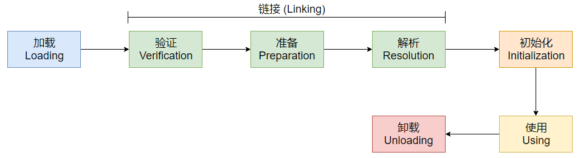

### 内存结构

- 程序计数器：线程独有，用来选取下一个需要执行的字节码指令
- 虚拟机栈：线程私有，每个方法的从调用直到执行完成，都对应着一个栈帧在虚拟机栈中出栈和入栈的过程
- Java堆：线程共享，分为新生代、老年代等
  - 新生代：对 HotSpot 而言，新生代又分为 Eden 空间和两块较小的 Survivor 空间，默认比例为8：1：1。划分的目的是因为 HotSpot 采用复制算法来回收新生代。GC 进行时，
    - Eden 区中所有存活的对象都会被复制到 To Survivor 区，
    - 而在 From Survivor 区中，仍存活的对象会根据它们的年龄值决定去向，年龄值达到年龄阀值（默认为15，新生代中的对象每熬过一轮垃圾回收，年龄值就加1，GC分代年龄存储在对象的 header 中）的对象会被移到老年代中，没有达到阀值的对象会被复制到 To Survivor 区。
    - 接着清空 Eden 区和 From Survivor 区，新生代中存活的对象都在 To Survivor 区。
    - 接着， From Survivor 区和 To Survivor区会交换它们的角色，也就是新的 To Survivor 区就是上次GC清空的 From Survivor 区，新的 From Survivor 区就是上次 GC 的 To Survivor 区，总之，不管怎样都会保证 To Survivor 区在一轮 GC 后是空的。
    - GC 时当 To Survivor 区没有足够的空间存放上一次新生代收集下来的存活对象时，需要依赖老年代进行分配担保，将这些对象存放在老年代中。
  - 老年代：在新生代中经历了多次 GC 后仍然存活下来的对象会进入老年代中。老年代中的对象生命周期较长，存活率比较高，在老年代中进行 GC 的频率相对而言较低，而且回收的速度也比较慢
- 方法区：线程共享，HotSpot 实现中也叫永久代，用于存储虚拟机加载的类信息、常量、静态变量、即时编译器编译后的代码等，一般不进行垃圾回收。
  - 运行时常量池：存放类加载后的字节码文件中常量池表项信息、翻译出来的直接引用等

### 垃圾回收

- 确定对哪些对象进行回收
  - **引用计数算法**：每个对象添加一个计算器，每当对象被引用就将计数器加1，当引用失效时就将计数器减1。每次都回收计数器为0的对象，实现简单，效率也高，但是存在对象相互循环引用的问题（它们都应被回收）。
  - **可达性分析**：设置一系列对象作为 **GC Roots**，沿着引用链向下搜索，当一个对象到`GC Roots`没有任何引用链连接时，说明`GC Roots`到该对象是不可达的，这时就可将该对象回收。（`GC Roots`主要是一些静态属性引用的对象）
- 垃圾回收算法
  - **标记-清除算法**：先标记所有要回收的对象，然后统一回收所有被标记的对象，缺点是效率不高，存在很多不连续内存碎片，主要用于对 **老年代** 的回收。
  - **复制算法**：将内存分为大小相等的两块（记为a、b），每次使用其中的一块（假设是a），当 a 用完了就将 a 上还存活的对象复制到 b 上面，然后将 a 的内存清理。缺点是当a上存活的对象较多时，将进行较多的复制操作，效率变低，所以主要用于对 **新生代** 的回收。
  - **标记-整理算法**：先标记所有要回收的对象，然后将所有存活对象都向一端移动，然后直接清理边界外的内存，主要用于对 **老年代** 的回收。

- Minor GC 和 Full GC

    - 新生代 GC（Minor GC）：Minor GC指发生在新生代的GC，因为新生代的Java对象大多都是朝生夕死，所以Minor GC非常频繁，一般回收速度也比较快。当Eden空间不足以为对象分配内存时，会触发Minor GC。
    - 老年代GC（Full GC 或 Major GC）：Full GC 指发生在老年代的 GC，出现了 Full GC 一般会伴随着至少一次的 Minor GC（老年代的对象大部分是 Minor GC 过程中从新生代进入老年代），比如：分配担保失败。Full GC 的速度一般会比 Minor GC 慢 10 倍以上。当老年代内存不足或者显式调用 `System.gc()` 方法时，会触发 Full GC。

### 垃圾收集器

垃圾收集器是内存回收的具体实现

1. Serial：一条 GC 线程，使用复制算法，作用于新生代，进行垃圾回收时会停止所有工作进程，直到收集结束，适用于单 CPU 或 Client 模式下，可结合 CMS 或 Serial Old 使用
   - 优点：简单高效，没有线程交互的开销，专注于GC
   - 缺点：stop the world，程序卡顿，用户体验差
2. ParNew：多条 GC 线程，使用复制算法，作用于新生代，进行垃圾回收时会停止所有工作进程，直到收集结束，适用于多 CPU 或 Server 模式下，可结合 CMS 或 Serial Old 使用
   - 优点：并行并发 GC
   - 缺点：stop the world
3. Parallel Scavenge：多条 GC 线程，使用复制算法，作用于新生代

| 名称                       | 收集算法                                | 区域          | 可配合对象                           | 线程 | 并发 | 适用场合                       | 优点                                                         | 缺点 |
| -------------------------- | --------------------------------------- | ------------- | ------------------------------------ | ---- | ---- | ------------------------------ | ------------------------------------------------------------ | ---- |
| Parallel Scavenge          | 复制算法                                | 新生代        | Serial Old;ParallelScavenge          | 多   | 是   | 吞吐量控制,Client,server均可以 | 主要关注吞吐量,通过吞吐量的设置控制停顿时间,适应不同的场景   |      |
| Serial Old                 | 标记整理算法                            | 老年代        | Serial,ParNew,Parallel  Scavenge     | 单   | 否   | 主要Client模式下               | 缺：stop the world                                           |      |
| Parallel Old               | 复制算法（Parallel Scavenge老年代版本） | 老年代        | Parallel Scavenge                    | 多   | 是   | 吞吐量控制,Client,server均可以 | 主要关注吞吐量,通过吞吐量的设置控制停顿时间,适应不同的场景   |      |
| CMS(Concurretn Mark Sweep) | 标记清除算法                            | 老年代        | Serial,ParNew,Serial Old是其备选方案 | 多   | 是   | 互联网站;B/S系统服务端         | 缺：CPU资源敏感,无法处理浮动垃圾,产生大量内存碎片优：并发收集,低停顿 |      |
| G1                         | 整体基于标记整理算法                    | 新生代&老年代 |                                      | 多   | 是   | 面向服务端应用                 | 优：并行与并发,分代收集,空间整合(标记整理算法),可预测停顿    |      |

### 类加载

类加载指的是虚拟机把描述类的数据从字节码文件加载待内存中，并对数据进行校验、转换解析和初始化，最终形成可被虚拟机直接使用的 Java 类型的过程。

包括了加载、验证、准备、解析、初始化这五个阶段。在这五个阶段中，加载、验证、准备和初始化这四个阶段发生的顺序是确定的，而解析阶段则是确定的，它在某些情况下，比如说，如果要实现动态绑定（如向上转型，动态绑定到子类的方法），解析会初始化阶段之后开始。

**加载**：查找并加载类的二进制数据，在这个阶段，虚拟机需要完成三件事情：

1. 通过一个类的全限定名来获取其定义的二进制字节流。

1. 根据Java虚拟机规范定义的字节码存储结构格式，将这个字节流所代表的静态存储结构转化为方法区的运行时数据结构。
2. 在内存中生成一个代表这个类的`java.lang.Class`对象，作为对方法区中这些数据的访问入口。

加载阶段完成后，虚拟机外部的二进制字节流就按照虚拟机所需的格式存储在方法区之中，而且在内存中（并未明确规定在 Java 堆中，**对 HotSpot VM 而言，Class对象较为特殊，不存储在堆，而存储在方法区中**）创建一个`java.lang.Class`类的对象，这样便可以通过该对象访问方法区中的这些数据。

**验证**：为了确保字节码文件的字节流中包含的信息符合当前虚拟机的要求，并且不会危害虚拟机的安全。 JVM 需要对字节码文件进行验证，验证的对象主要有：字节码文件格式、字节码中元数据定义、字节码中的指令逻辑以及符号引用。

**准备**：为类变量在`方法区`分配内存并`设置类变量默认初始值`。

**解析**：将常量池内的符号引用替换为直接引用，解析动作主要针对类或接口、字段、类方法、接口方法、方法类型、方法句柄和调用点限定符 7 类符号引用进行。符号引用是一组符号来描述目标，可以是任何字面量。直接引用就是直接指向目标的指针、相对偏移量或一个间接定位到目标的句柄。

