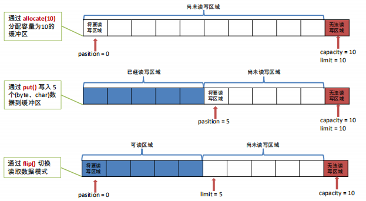
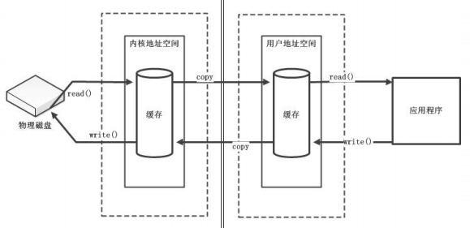
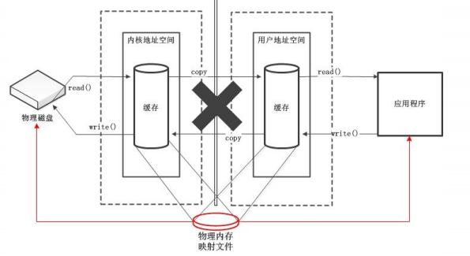
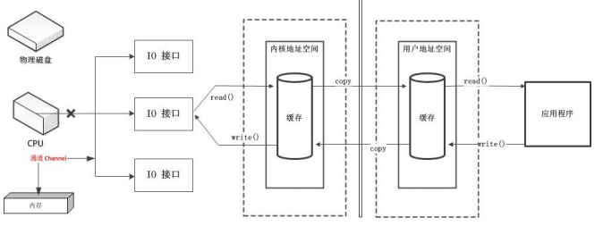
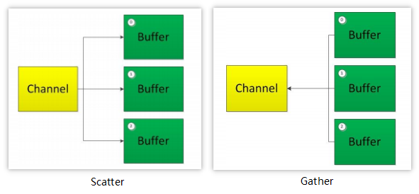
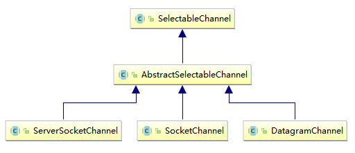

## 简介

Java NIO（New IO）是从 Java 1.4 版本开始引入的一个新的IO API，可以替代标准的Java IO API。NIO与原来的IO有同样的作用和目的，但是使用的方式完全不同，NIO支持面向缓冲区的、基于通道的IO操作。NIO将以更加高效的方式进行文件的读写操作。Java NIO **与** IO 的主要区别：

| IO                        | NIO                            |
| ------------------------- | ------------------------------ |
| 面向流（Stream Oriented） | 面向缓冲区（Buffer Oriented）  |
| 阻塞式 IO（Blocking IO）  | 非阻塞式 IO（Non Blocking IO） |

## 通道和缓冲区

Java NIO 系统的核心在于：通道（Channel）和缓冲区（Buffer）。通道表示打开到 IO 设备（如文件、套接字）的连接。若需要使用 NIO 系统，需要获取用于连接 IO 设备的通道以及用于容纳数据的缓冲区。然后操作缓冲区，对数据进行处理。

### 缓冲区

缓冲区是一个用于特定基本数据类型的容器。由 java.nio 包定义的，所有缓冲区都是 Buffer 抽象类的子类。 Java NIO 中的 Buffer 主要用于与 NIO 通道进行交互，数据是从通道读入缓冲区，从缓冲区写入通道中的。

Buffer 就像一个数组，可以保存多个相同类型的数据。根据数据类型不同(boolean 除外) ，有以下 Buffer 常用子类：ByteBuffer、CharBuffer、ShortBuffer、IntBuffer、LongBuffer、FloatBuffer、DoubleBuffer。

上述 Buffer 类 他们都采用相似的方法进行管理数据，只是各自管理的数据类型不同而已。都是通过如下方法获取一个 Buffer 对象：

```java
// 创建一个容量为 capacity 的 XxxBuffer 对象
static XxxBuffer allocate(int capacity)
```

缓冲区的基本属性

1. **容量（capacity）：** 表示 Buffer 最大数据容量，缓冲区容量不能为负，并且创建后不能更改。 
2. **限制（limit）：** 第一个不应该读取或写入的数据的索引，即位于 limit 后的数据不可读写。缓冲区的限制不能为负，并且不能大于其容量。  
3. **位置（position）：** 下一个要读取或写入的数据的索引。缓冲区的位置不能为负，并且不能大于其限制。
4. **标记（mark）与重置（reset）：** 标记是一个索引，通过 Buffer 中的 mark() 方法指定 Buffer 中一个特定的 position，之后可以通过调用 reset() 方法恢复到这个 position.

<div align="center">  </div><br>

### Buffer常用方法

|          方法          |                            描述                             |
| :--------------------: | :---------------------------------------------------------: |
|     Buffer clear()     |               清空缓冲区并返回对缓冲区的引用                |
|     Buffer flip()      |     将缓冲区的界限设置为当前位置，并将当前位置重置为 0      |
|     int capacity()     |                      返回缓冲区的容量                       |
| boolean hasRemaining() |                   判断缓冲区是否还有元素                    |
|      int limit()       |               返回缓冲区的界限（limit）的位置               |
|  Buffer limit(int m)   | 将设置缓冲区界限为 m，并返回一个具有新 limit 的 Buffer 对象 |
|     Buffer mark()      |                    对缓冲区位置进行标记                     |
|     int position()     |             返回缓冲区的当前（position）的位置              |
| Buffer position(int m) |   将设置缓冲区的当前位置为 m，并返回修改后的 Buffer 对象    |
|    int remaining()     |            返回 position 和 limit 之间的元素个数            |
|     Buffer reset()     |       将位置 position 转到以前设置的 mark 所在的位置        |
|    Buffer remind()     |                将位置设为 0，取消设置的 mark                |

Buffer 所有子类提供了两个用于数据操作的方法：get() 与 put() 方法 

获取 Buffer 中的数据

- get() ：读取单个字节 
- get(byte[] dst)：批量读取多个字节到 dst 中 
- get(int index)：读取指定索引位置的字节(不会移动 position)

放入数据到缓冲区

- put(byte b)：将给定单个字节写入缓冲区的当前位置 
- put(byte[] src)：将 src 中的字节写入缓冲区的当前位置 
- put(int index, byte b)：将指定字节写入缓冲区的索引位置（不会移动 position）

## 直接与非直接缓冲区

字节缓冲区要么是直接的，要么是非直接的。如果是非直接缓冲区，则传输数据时需经过内核地址空间到 JVM 进程地址空间之间的复制操作，这是一种比较重复而低效的过程。

<div align="center">  </div><br>

如果为直接字节缓冲区，则 Java 虚拟机会尽最大努力直接在此缓冲区上执行本机 I/O 操作。也就是说，在每次调用基础操作系统的一个本机 I/O 操作之前（或之后），虚拟机都会尽量避免将缓冲区的内容复制到中间缓冲区中（或从中间缓冲区中复制内容）。

<div align="center">  </div><br>

直接字节缓冲区可以通过调用此类的 allocateDirect() 工厂方法来创建。此方法返回的缓冲区进行分配和取消分配所需成本通常高于非直接缓冲区。直接缓冲区的内容可以驻留在常规的垃圾回收堆之外，因此，它们对应用程序的内存需求量造成的影响可能并不明显。所以，建议将直接缓冲区主要分配给那些易受基础系统的 本机 I/O 操作影响的大型、持久的缓冲区。一般情况下，最好仅在直接缓冲区能在程序性能方面带来明显好处时分配它们。

直接字节缓冲区还可以通过 FileChannel 的 map() 方法 将文件区域直接映射到内存中来创建。该方法返回 MappedByteBuffer 。Java 平台的实现有助于通过 JNI 从本机代码创建直接字节缓冲区。如果以上这些缓冲区中的某个缓冲区实例指的是不可访问的内存区域，则试图访问该区域不会更改该缓冲区的内容，并且将会在访问期间或稍后的某个时间导致抛出不确定的异常。

字节缓冲区是直接缓冲区还是非直接缓冲区可通过调用其 isDirect() 方法来确定。提供此方法是为了能够在性能关键型代码中执行显式缓冲区管理。

## 通道（Channel）

通道（Channel）：由 java.nio.channels 包定义的。Channel 表示 IO 源与目标打开的连接。Channel 类似于传统的“流”。只不过 Channel 本身不能直接访问数据，Channel 只能与 Buffer 进行交互。使用通道代替原来的 DMA 总线。

<div align="center">  </div><br>

Java 为 Channel 接口提供的最主要实现类如下：

- FileChannel：用于读取、写入、映射和操作文件的通道。
- DatagramChannel：通过 UDP 读写网络中的数据通道。
- SocketChannel：通过 TCP 读写网络中的数据。
- ServerSocketChannel：可以监听新进来的 TCP 连接，对每一个新进来的连接都会创建一个SocketChannel。

获取通道的一种方式是对支持通道的对象调用、

1. getChannel() 方法。支持通道的类有：FileInputStream、FileOutputStream、RandomAccessFile、DatagramSocket、Socket、ServerSocket。

2. 使用 Files 类的静态方法 newByteChannel() 获取字节通道
3. 通过通道的静态方法 open() 打开并返回指定通道。

通道的数据传输

```java
// 将 Buffer 中的数据写入 Channel 
int bufferWritten = inChannel.write(buf);

// 从 Channel 中 读取数据到 Buffer 中
int bufferRead = inChannel.read(buf);
```

## 分散读和聚集写

分散读取（Scattering Reads）是指从 Channel 中读取的数据“分散”到多个 Buffer 中（注意：按照缓冲区的顺序，从 Channel 中读取的数据依次将 Buffer 填满）。

<div align="center">  </div><br>

聚集写入（Gathering Writes）是指将多个 Buffer 中的数据“聚集” 到 Channel（注意：按照缓冲区的顺序，写入 position 和 limit 之间的数据到 Channel）。 

## NIO 的非阻塞

### 阻塞与非阻塞

传统的 IO 流都是阻塞式的。也就是说，当一个线程调用 read() 或 write() 时，该线程被阻塞，直到有一些数据被读取或写入，该线程在此期间不能执行其他任务。因此，在完成网络通信进行 IO 操作时，由于线程会阻塞，所以服务器端必须为每个客户端都提供一个独立的线程进行处理，当服务器端需要处理大量客户端时，性能急剧下降。

Java NIO 是非阻塞模式的。当线程从某通道进行读写数据时，若没有数据可用时，该线程可以进行其他任务。线程通常将非阻塞 IO 的空闲时间用于在其他通道上执行 IO 操作，所以单独的线程可以管理多个输入和输出通道。因此，NIO 可以让服务器端使用一个或有限几个线程来同时处理连接到服务器端的所有客户端。

### 选择器（Selector）

选择器（Selector） 是 SelectableChannle 对象的多路复用器，Selector 可以同时监控多个 SelectableChannel 的 IO 状况，也就是说，利用 Selector 可使一个单独的线程管理多个 Channel。Selector 是非阻塞 IO 的核心。SelectableChannel 的结构如下图：

<div align="center">  </div><br>

#### 选择器（Selector）的应用

- 创建 Selector ：通过调用 Selector.open() 方法创建一个 Selector。

- 向选择器注册通道：SelectableChannel.register(Selector sel, int ops)

```java
@org.junit.Test
public void test() throws IOException {
	// 创建一个 Socket 套接字
    Socket socket = new Socket(InetAddress.getByName("127.0.0.1"), 9090);

	// 获取 SocketChannel
    SocketChannel socketChannel = socket.getChannel();

	// 创建选择器
    Selector selector = Selector.open();

	// 将 SocketChannel 切换到非阻塞模式
    socketChannel.configureBlocking(false);

	// 向 Selector 注册 Channel
    SelectionKey key = socketChannel.register(selector, SelectionKey.OP_READ);
}
```

当调用 register(Selector sel, int ops) 将通道注册选择器时，选择器对通道的监听事件，需要通过第二个参数 ops 指定。

可以监听的事件类型（可使用 SelectionKey 的四个常量表示）：

- 读 : SelectionKey.OP_READ （1） 
- 写 : SelectionKey.OP_WRITE （4） 
- 连接 : SelectionKey.OP_CONNECT （8） 
-  接收 : SelectionKey.OP_ACCEPT （16）

若注册时不止监听一个事件，则可以使用“位或”操作符连接。

#### SelectionKey

表示 SelectableChannel 和 Selector 之间的注册关系。每次向选择器注册通道时就会选择一个事件(选择键)。选择键包含两个表示为整数值的操作集。操作集的每一位都表示该键的通道所支持的一类可选择操作。

|            方法             |               描述               |
| :-------------------------: | :------------------------------: |
|      int interestOps()      |        获取感兴趣事件集合        |
|       int readyOps()        | 获取通道已经准备就绪的操作的集合 |
| SelectableChannel channel() |           获取注册通道           |
|     Selector selector()     |            返回选择器            |
|    boolean isReadable()     |  检测 Channel 中读事件是否就绪   |
|    boolean isWritable()     |  检测 Channel 中写事件是否就绪   |
|   boolean isConnectable()   |   检测 Channel 中连接是否就绪    |
|   boolean isAcceptable()    |   检测 Channel 中接收是否就绪    |

#### Selector 的常用方法

|               方法                |                             描述                             |
| :-------------------------------: | :----------------------------------------------------------: |
|     Set\<SelectionKey> keys()     |     SelectionKey 集，代表注册在该 Selector 上的 Channel      |
| Set\<SelectionKey> selectedKeys() |          返回此 Selector 已选择的 SelectionKey 集，          |
|           int select()            | 监控所有注册的 Channel，当它们中有需要处理的 IO 操作时，该方法返回，并将对应得到的 SelectionKey 加入被选择的 SelectionKey 集中，该方法返回这些 Channel 的数量 |
|     int select(long timeout)      |                可设置超时时长的 select() 操作                |
|          int selectNow()          |      执行一个立即返回的 select 操作，该方法不会阻塞线程      |
|         Selector wakeup()         |            使一个还没返回的 select() 方法立即返回            |
|           void close()            |                         关闭该选择器                         |


## 参考

1. bilibili--尚硅谷 NIO 视频教程：https://www.bilibili.com/video/av35956039/?p=1