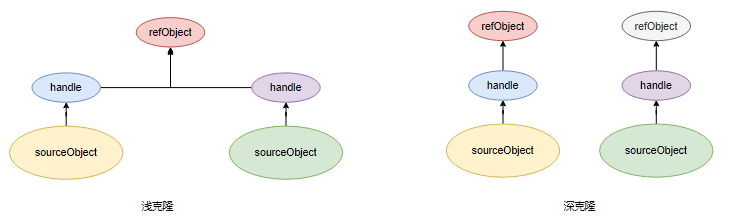

在日常开发中，我们经常需要将某个数据库实体对象转换为业务对象或传输对象，而这些对象很多情况下具有一样的属性，甚至在那个时刻属性的取值都是一样，那么有可能在你的业务层中，存在很多类似下面这样的代码。

```java
public List<UserResponses() {}> someKindOfService() {
    List<User> users = userService.getUsers();
    // 省略 n 行业务代码
    return changeToUserResponses(users)
}

private List<UserResponse> changeToUserResponses(List<User> users) {
	List<UserResponse> responses = new ArrayList<>();
    if (CollectionUtil.isEmpty(users)) {
        return responses;
    }
    users.foreach(user -> {
        responses.add(changeToUserResponse(user));
    });
    return responses;
}

private UserResponse changeToUserResponse(User user) {
    if (Objects.isNull(user)) {
        throw new IllegalArgumentException("user is null"); 
    }
    UserResponse respone = new UserResponse();
    respone.setId(user.getId());
    respone.setName(user.getName());
    respone.setRegisterTimeStr(TimeUtil.format(user.getRegisterTime()));
    //.. 省略 100 行 get 和 set
    return respone;
}
```

可以看到，UserResponse 和 User 类型往往存在很多相同属性，User 是与数据库表对应的实体类，而 UserResponses  是在 service 层到 controller 层之间传输响应类，我们可以在 UserResponses  中针对 User 做很多翻译和扩展，比如时间类型数据的格式化、业务设计的成员属性的获取等等都可以设置进 UserResponses  对象中进行传输，但是问题是当两者的属性重复度高时，需要在 User 与 UserResponses  对象的转换中进行很多次无聊重复的 get 和 set 惭怍，当属性很多时会让人抓狂。

这时有人可能就会问了，有没有什么办法进行两个对象的属性拷贝呢？今天我们来探讨下这个问题。

## 对象克隆

说到属性拷贝，不得不提的一个概念是对象克隆。

众所周知，在 Java 的世界里，一切对象都源于 `java.lang.Object`，而 `java.lang.Object` 中定义了一个叫做`clone` 的方法用于对象的克隆，

```java
/**
 * 描述太长，略
 * @return     a clone of this instance.
 * @throws  CloneNotSupportedException  if the object's class does not
 *               support the {@code Cloneable} interface. Subclasses
 *               that override the {@code clone} method can also
 *               throw this exception to indicate that an instance cannot
 *               be cloned.
 * @see java.lang.Cloneable
 */
protected native Object clone() throws CloneNotSupportedException;
```

可以看到，这是一个本地方法，索然隐藏了实现细节，但是我们知道通过 obj 调用`obj.clone()`，将得到一个 obj 的一个副本。另外，通过省略的描述可以知道

- 对任何的对象 x，都有 `x.clone() != x`，即克隆对象与原对象不是同一个对象。

- 对任何的对象x，都有 `x.clone().getClass()==x.getClass()`，即克隆对象与原对象的类型一样。

- 如果对象 x 的 equals() 方法定义恰当，那么 `x.clone().equals(x)` 应该成立。

话说回来，这样看一切的对象都具有 `可克隆` 的潜质，不过需要实现 Cloneable 接口才能发挥这样的潜质，那么 Cloneable 接口长什么样呢？

```java
package java.lang;
public interface Cloneable {}
```

没错，与 `java.io.Serializable` 一样，这是个空的接口，只是起到一个功能标识的作用。那么这个 clone 方法怎么使用呢？先看代码：


```java
package copy.shadow;

import lombok.AllArgsConstructor;
import lombok.ToString;

@AllArgsConstructor
@ToString
class Course {
    int id;
    String name;
}

@AllArgsConstructor
@ToString
class Student implements Cloneable {
    int id;
    String name;
    Course course;

    // 默认实现，浅拷贝
    protected Object clone() throws CloneNotSupportedException {
        return super.clone();
    }
}

public class ShallowCopyInJava {
    public static void main(String[] args) {
        Course science = new Course(1, "science");
        Student srcStudent = new Student(111, "John", science);
        Student destStudent = null;
        try {
            destStudent = (Student) srcStudent.clone();
        } catch (CloneNotSupportedException e) {
           return;
        }
        System.out.println("srcStudent: " + srcStudent);
        System.out.println("destStudent: " + destStudent);
        System.out.println("srcStudent == destStudent ？ " + (srcStudent == destStudent));
        System.out.println("srcStudent 与 destStudent 的引用的对象是否相同？ " + (srcStudent.course == destStudent.course));
        System.out.println("srcStudent.getClass() == destStudent.getClass()？ " + (srcStudent.getClass() == destStudent.getClass()));
    }
}
```

运行结果

```
srcStudent: Student(id=111, name=John, course=Course(id=1, name=science))
destStudent: Student(id=111, name=John, course=Course(id=1, name=science))
srcStudent == destStudent ？ false
srcStudent 与 destStudent 的引用的对象是否相同？ true
srcStudent.getClass() == destStudent.getClass()？ true
```

通过运行结果，验证了上面提到的两点：

- 对任何的对象 x，都有 `x.clone() != x`，即克隆对象与原对象不是同一个对象。

- 对任何的对象x，都有 `x.clone().getClass()==x.getClass()`，即克隆对象与原对象的类型一样。

同时，我们注意到，`srcStudent.course == destStudent.course`，这说明，clone 方法实现的是浅克隆。那么什么是浅克隆呢？

- 浅克隆：拷贝原对象的所有基本数据类型属性及引用类型属性的引用。
- 深克隆：拷贝原对象的所有基本数据类型属性及引用类型属性的对象。

对于被克隆对象 source 和拷贝完的目标对象 target，如果只是将 source 中的基本数据类型拷贝到 target，那么没有浅克隆和深拷贝的说法，直接克隆便好；而对于 source 中引用类型属性 `attr`（假设指向 `heapObj`），浅克隆过程会在 target 的栈上创建新的一份引用 `attr1` 指向 `heapObj`，即两个引用指向同一个对象。

而对于深克隆，克隆引用属性过程中会在创建新引用的同时，在堆上复制一分对象的数据并生成新的对象，两个引用所指向的是两个不同的对象。



那么什么是克隆呢？下面是摘自百科的解释：

> 克隆是指生物体通过体细胞进行的无性繁殖，以及由无性繁殖形成的基因型完全相同的后代个体组成的种群。通常是利用生物技术由无性生殖产生与原个体有完全相同基因的个体或种群。
> 克隆是英文"clone"或"cloning"的音译，而英文"clone"则起源于希腊文"Klone"，原意是指以幼苗或嫩枝插条，以无性繁殖或营养繁殖的方式培育植物，如扦插和嫁接。译为“无性繁殖”，复制，转殖或群殖。 中文也有更加确切的词表达克隆，“无性繁殖”、“无性系化”以及“纯系化”。

注意到一个点是，克隆产生的个体是与原被克隆的个体同属一个种的，

- 浅拷贝：拷贝原对象的所有基本数据类型属性及引用类型属性的引用。
- 深拷贝：拷贝原对象的所有基本数据类型属性及引用类型属性的对象。


实现拷贝的方式

- 实现 Java 提供的 clone 方法
- Spring 提供的 `BeanUtils.copyPropertie` 方法
- `cglib` 的  `BeanCopier`
- JSON 序列化与反序列化

### clone 方法

使用 `java.lang.Obejct` 的 clone 方法实现对象的拷贝


《阿里巴巴开发规范》中提到

> 20. 【推荐】慎用 Object 的 clone 方法来拷贝对象。
>
>  说明：对象的 clone 方法默认是浅拷贝，若想实现深拷贝需要重写 clone 方法实现域对象的
>
>  深度遍历式拷贝。

可通过覆盖 clone 方法实现深拷贝

```java
package copy.deep;

import lombok.AllArgsConstructor;
import lombok.ToString;

@AllArgsConstructor
@ToString
class Course implements Cloneable {
    int id;
    String name;

    protected Object clone() throws CloneNotSupportedException {
        return super.clone();
    }
}

@AllArgsConstructor
@ToString
class Student implements Cloneable {
    int id;
    String name;
    Course course;
 
    // 重写 clone 方法，实现深拷贝
    protected Object clone() throws CloneNotSupportedException {
        Student student = (Student) super.clone();
        student.course = (Course) course.clone();
        return student;
    }
}

public class DeepCopyInJava {
    public static void main(String[] args) {
        Course science = new Course(1, "science");
        Student srcStudent = new Student(111, "John", science);
        Student destStudent = null;
 
        try {
            destStudent = (Student) srcStudent.clone();
        } catch (CloneNotSupportedException e) {
            return;
        }
        System.out.println("srcStudent: " + srcStudent);
        System.out.println("destStudent: " + destStudent);
        System.out.println("srcStudent == destStudent ？ " + (srcStudent == destStudent));
        System.out.println("srcStudent 与 destStudent 的引用的对象是否相同？ " + (srcStudent.course == destStudent.course));
    }
}
```

运行结果

```
srcStudent: Student(id=111, name=John, course=Course(id=1, name=science))
destStudent: Student(id=111, name=John, course=Course(id=1, name=science))
srcStudent == destStudent ？ false
srcStudent 与 destStudent 的引用的对象是否相同？ false
```

## 序列化深克隆

```java
package copy.serialization;

import lombok.AllArgsConstructor;
import lombok.ToString;

import java.io.*;

@AllArgsConstructor
@ToString
class Course implements Serializable{
    int id;
    String name;
}

@AllArgsConstructor
@ToString
class Student implements Serializable {
    int id;
    String name;
    Course course;
}

public class SerializationCopyDemo {

    public static void main(String[] args) throws IOException, ClassNotFoundException {
        Course science = new Course(1, "science");
        Student srcStudent = new Student(111, "John", science);
        Student destStudent = (Student) deepCopy(srcStudent);
        System.out.println("srcStudent: " + srcStudent);
        System.out.println("destStudent: " + destStudent);
        System.out.println("srcStudent == destStudent ？ " + (srcStudent == destStudent));
        System.out.println("srcStudent 与 destStudent 的引用的对象是否相同？ " + (srcStudent.course == destStudent.course));
    }

    public static <S> Object deepCopy(S source) throws IOException, ClassNotFoundException {
        // 将对象写到流里
        ByteArrayOutputStream bo = new ByteArrayOutputStream();
        ObjectOutputStream oo = new ObjectOutputStream(bo);
        oo.writeObject(source);
        // 从流里读出来
        ByteArrayInputStream bi = new ByteArrayInputStream(bo.toByteArray());
        ObjectInputStream oi = new ObjectInputStream(bi);
        // todo close streams
        return oi.readObject();
    }
}
```

运行结果

```java
srcStudent: Student(id=111, name=John, course=Course(id=1, name=science))
destStudent: Student(id=111, name=John, course=Course(id=1, name=science))
srcStudent == destStudent ？ false
srcStudent 与 destStudent 的引用的对象是否相同？ false
```


### BeanCopier 深拷贝

`BeanCopier`是用于在两个`bean`之间进行属性拷贝的。`BeanCopier`支持两种方式:

1. 一种是不使用 `Converter` 的方式，仅对两个 `bean` 间属性名和类型完全相同的变量进行拷贝;
2. 另一种则引入`Converter`，可以对某些特定属性值进行特殊操作。

引入依赖

```xml
<dependency>
    <groupId>cglib</groupId>
    <artifactId>cglib</artifactId>
    <version>2.2.2</version>
</dependency>
```

由于 Spring 中已经集成了 `cglib`，所以如果你已经在工程中引入 Spring，则可直接使用`org.springframework.cglib.beans.BeanCopier`。

```java
package copy.copier;

import lombok.AllArgsConstructor;
import lombok.ToString;
import net.sf.cglib.beans.BeanCopier;

import java.io.Serializable;

@AllArgsConstructor
@ToString
class Course {
    int id;
    String name;
}

@AllArgsConstructor
@ToString
class Student {
    int id;
    String name;
    Course course;

    public Student() { }
}

public class CopierDemo {
    public static void main(String[] args) {
        // 源对象，目标对象，是否使用自定义转换器
        BeanCopier copier = BeanCopier.create(Student.class, Student.class, false);
        Course science = new Course(1, "science");
        Student srcStudent = new Student(111, "John", science);
        Student destStudent = new Student();
        copier.copy(srcStudent, destStudent, null);
        System.out.println("srcStudent: " + srcStudent);
        System.out.println("destStudent: " + destStudent);
        System.out.println("srcStudent == destStudent ？ " + (srcStudent == destStudent));
        System.out.println("srcStudent 与 destStudent 的引用的对象是否相同？ " + (srcStudent.course == destStudent.course));
    }
}
```

运行结果

```
srcStudent: Student(id=111, name=John, course=Course(id=1, name=science))
destStudent: Student(id=0, name=null, course=null)
srcStudent == destStudent ？ false
srcStudent 与 destStudent 的引用的对象是否相同？ false
```

可见这是深拷贝


Spring 中提供了 `BeanUtils.copyProperties(Object source, Object target)` 方法实现对两个对象的浅拷贝。

```java
public static void copyProperties(Object source, Object target) throws BeansException {
    copyProperties(source, target, (Class)null, (String[])null);
}

public static void copyProperties(Object source, Object target, Class<?> editable) throws BeansException {
    copyProperties(source, target, editable, (String[])null);
}

public static void copyProperties(Object source, Object target, String... ignoreProperties) throws BeansException {
    copyProperties(source, target, (Class)null, ignoreProperties);
}

private static void copyProperties(Object source, Object target, Class<?> editable, String... ignoreProperties) throws BeansException {
    Assert.notNull(source, "Source must not be null");
    Assert.notNull(target, "Target must not be null");
    Class<?> actualEditable = target.getClass();
    if (editable != null) {
        if (!editable.isInstance(target)) {
            throw new IllegalArgumentException("Target class [" + target.getClass().getName() + "] not assignable to Editable class [" + editable.getName() + "]");
        }
        actualEditable = editable;
    }

    PropertyDescriptor[] targetPds = getPropertyDescriptors(actualEditable);
    List<String> ignoreList = ignoreProperties != null ? Arrays.asList(ignoreProperties) : null;
    PropertyDescriptor[] var7 = targetPds;
    int var8 = targetPds.length;

    for(int var9 = 0; var9 < var8; ++var9) {
        PropertyDescriptor targetPd = var7[var9];
        Method writeMethod = targetPd.getWriteMethod();
        if (writeMethod != null && (ignoreList == null || !ignoreList.contains(targetPd.getName()))) {
            PropertyDescriptor sourcePd = getPropertyDescriptor(source.getClass(), targetPd.getName());
            if (sourcePd != null) {
                Method readMethod = sourcePd.getReadMethod();
                if (readMethod != null && ClassUtils.isAssignable(writeMethod.getParameterTypes()[0], readMethod.getReturnType())) {
                    try {
                        if (!Modifier.isPublic(readMethod.getDeclaringClass().getModifiers())) {
                            readMethod.setAccessible(true);
                        }

                        Object value = readMethod.invoke(source);
                        if (!Modifier.isPublic(writeMethod.getDeclaringClass().getModifiers())) {
                            writeMethod.setAccessible(true);
                        }

                        writeMethod.invoke(target, value);
                    } catch (Throwable var15) {
                        throw new FatalBeanException("Could not copy property '" + targetPd.getName() + "' from source to target", var15);
                    }
                }
            }
        }
    }

}
```

可以看到，成员变量赋值是基于目标对象的成员列表，并且会跳过 `ignore` 的以及在源对象中不存在的，所以这个方法是安全的，不会因为两个对象之间的结构差异导致错误，但是必须保证同名的两个成员变量类型相同。


pom.xml

```xml
<dependencies>
    <!-- https://mvnrepository.com/artifact/junit/junit -->
    <dependency>
        <groupId>junit</groupId>
        <artifactId>junit</artifactId>
        <version>4.12</version>
        <scope>test</scope>
    </dependency>

    <!-- https://mvnrepository.com/artifact/cglib/cglib -->
    <dependency>
        <groupId>cglib</groupId>
        <artifactId>cglib</artifactId>
        <version>2.2.2</version>
    </dependency>

    <!-- https://mvnrepository.com/artifact/org.springframework/spring-beans -->
    <dependency>
        <groupId>org.springframework</groupId>
        <artifactId>spring-beans</artifactId>
        <version>5.2.4.RELEASE</version>
    </dependency>

    <!-- https://mvnrepository.com/artifact/org.projectlombok/lombok -->
    <dependency>
        <groupId>org.projectlombok</groupId>
        <artifactId>lombok</artifactId>
        <version>1.18.10</version>
        <scope>provided</scope>
    </dependency>
</dependencies>
```


参考

- https://juejin.im/post/5c988a7ef265da6116246d11#heading-2
- https://javaconceptoftheday.com/difference-between-shallow-copy-vs-deep-copy-in-java/
- https://houbb.github.io/2019/01/09/java-deep-copy
- https://github.com/ydq/blog/issues/20
- https://www.cnblogs.com/winner-0715/p/10117282.html
- https://my.oschina.net/iioschina/blog/1934853
- https://juejin.im/post/5dc2b293e51d456e65283e61
- https://tommy88.top/2018/04/13/share-one-object-copy-utility/

JVM - 四种引用

- https://blog.csdn.net/Mollychin/article/details/78059326
- https://juejin.im/entry/5a085809f265da430c114c8b

reflect + asm

- https://github.com/EsotericSoftware/reflectasm/pull/67
- https://houbb.github.io/2018/07/20/asm-14-reflectasm

HashMap + SynchronizedHashMap 怎么实现线程安全的？

可以考虑在某个工具类中实现可增删的 Arrays.asList()

MySQL

- https://www.cnblogs.com/myseries/p/11265849.html