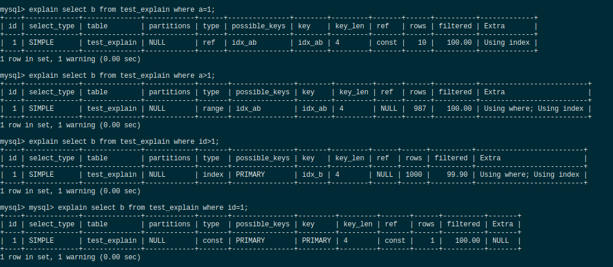

MySQL 优化器会根据表、列、索引信息以及 WHERE 子句中的条件来考虑使用何种技术有效地执行 SQL 查询，比如，无需读取所有行即可执行对巨大表的查询； 无需比较行的每个组合即可执行涉及多个表的 join 等等。 优化器选择执行最有效查询的一组操作称为“查询执行计划”，也称为 EXPLAIN 计划。作为 MySQL 的使用者，掌握执行计划的各个方面的是很有必要，这将使你清楚自己的查询是否已被优化，并且如果发现一些低效的操作，则能给你带来新的思考，迫使你去学习 SQL 语法和索引技术以改进计划。

建个测试表，同时使用存储过程造点数据

```mysql
create table test_explain (
	id int(11) not null,
    a int(11) not null,
    b int(11) not null,
    c int(11) not null,
    primary key(id),
    key idx_ab (a,b),
    key idx_b (b)
) engine = InnoDB default charset = utf8;

drop procedure idata;
delimiter ;;
create procedure idata()
    begin
        declare i int;
        set i=1;
        while(i <= 1000) do
        insert into test_explain values(i, RAND() * 100, RAND() * 100, i);
        set i=i+1;
        end while;
    end;;
delimiter ;
call idata();
```

查看下表行数

```mysql
mysql> select count(*) from test_explain;
+----------+
| count(*) |
+----------+
|     1000 |
+----------+
```

随便写几条查询进行执行计划分析




### extra

using index


参考

- [MySQL 5.7 官方手册 - Understanding the Query Execution Plan](https://dev.mysql.com/doc/refman/5.7/en/execution-plan-information.html)