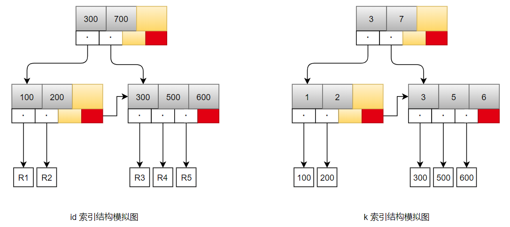
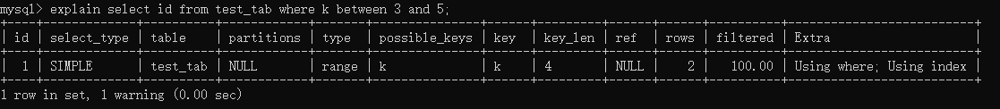

在下面这个表 T 中

```mysql
create table test_tab (
    id int primary key,
    k int NOT NULL DEFAULT 0,
    s varchar(16) NOT NULL DEFAULT '',
    index k(k)
) engine=InnoDB;

insert into test_tab values
(100,1, 'aa'),
(200,2,'bb'),
(300,3,'cc'),
(500,5,'ee'),
(600,6,'ff'),
(700,7,'gg');
```

如果执行·

```mysql
select * from test_tab where k between 3 and 5
```

需要执行几次树的搜索操作，会扫描多少行？

下面是参考维基百科中 B+ 树示例图，模拟根据样例数据构造出来的索引结构：



现在，我们一起来看看这条 SQL 查询语句的执行流程： 

1. 在 k 索引树上找到 k=3 的记录，取得 id = 300； 
2. 再到 id 索引树查到 id=300 对应的 R3；
3. 在 k 索引树取下一个值 k=5，取得 id=500； 
4. 再回到 id 索引树查到 id=500 对应的 R4； 
5. 在 k 索引树取下一个值 k=6，不满足条件，循环结束。

> 需要先明确一的点是，between..and 相当于 >= && <= ，是于一个左闭右闭的范围。

在这个过程中，回到主键索引树搜索的过程，被称为**回表**。可以看到，这个查询过程读了 k 索引树的 3 条记录（步骤 1、3 和 5），回表了两次（步骤 2 和 4）。

在这个例子中，由于查询结果所需要的数据只在主键索引上有，所以不得不回表。那么，有没有可能经过索引优化，避免回表过程呢？

### 覆盖索引

如果执行的语句是

```mysql
select id from test_tab where k between 3 and 5;
```

这时只需要查 id 的值，而 id 的值已经在 k 索引树上了，因此可以直接提供查询结果，不需要回表。也就是说，在这个查询里面， 索引 k 已经“覆盖了”我们的查询需求，所以称为**覆盖索引**。

**由于覆盖索引可以减少树的搜索次数，显著提升查询性能，所以使用覆盖索引是一个常用 的性能优化手段。**

通过 explain 命令分析执行计划，将看到



需要注意的是，在引擎内部使用覆盖索引在索引 k 上其实读了三个记录，R3~R5（对应的索引 k 上的记录项），但是对于 MySQL 的 Server 层来说，它就是找引擎拿到了两条记录，因此 MySQL 认为扫描行数是 2。

另外对于 extra 列，根据 MySQL 5.7 官方手册

> The column information is retrieved from the table using only information in the index tree without having to do an additional seek to read the actual row. This strategy can be used when the query uses only columns that are part of a single index.

大概意思是当查询直接使用索引的信息，而不用通过附加的操作去找实际的行数据（回表），换言之，当满足覆盖索引情况下，此处将会显示 `using index`。