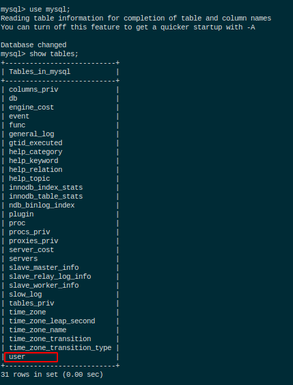
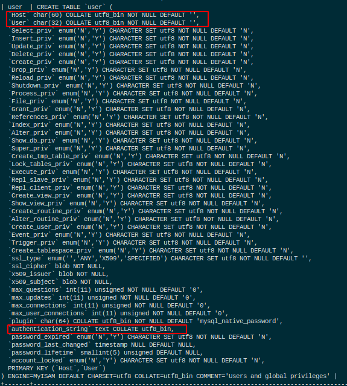

## 一. Ubuntu

实验环境

- MySQL：5.7.29-0ubuntu0.18.04.1 (Ubuntu)
- OS：Ubuntu 19.04

1.在终端输入

```shell
sudo vim /etc/mysql/mysql.conf.d/mysqld.cnf
```

在末尾追加一行以下的内容

```shell
skip-grant-tables
```


3.重启 mysql 服务

```shell
sudo service mysql restart
```

4.在终端输入命令 mysql，进入 mysql

5.使用命令`use mysql`，切换到 mysql 数据库

用户相关信息存储在 user 表中



查看 suer 表结构，其中 Host、User、authentication_string 是我们需要修改的字段，authentication_string 是使用 password 函数生成的信息摘要值。



6.修改 root 密码

```mysql
UPDATE mysql.user SET authentication_string=password('你想设置的密码') WHERE User='root' AND Host ='localhost';
```

7.修改字段 plugin(Plugin 字段标识可以用于验证用户身份的插件，如果字段为空，服务器使用内建授权验证机制验证用户身份

```mysql
UPDATE user SET plugin="mysql_native_password";
```

8.刷新权限,输入命令

```mysql
flush privileges;
```

9.退出 mysql

```mysql
quit;
```

10.把配置文件`/etc/mysql/mysql.conf.d/mysqld.cnf)`内的命令注释掉。

11.重启 mysql 服务。