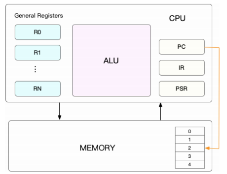
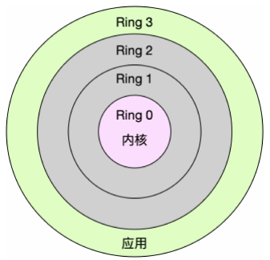
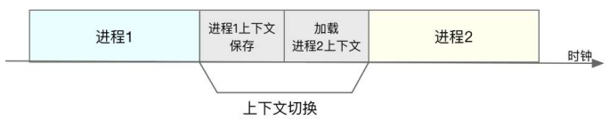

前面实验分析到，多个进程竞争 CPU 会导致平均负载升高，但是进程在竞争 CPU 的时和并没有真正运行，为什么会导致系统的负载升高呢？原因就在于 CPU 上下文切换。

Linux 是一个多任务操作系统，它支持远大与 CPU 数量的任务同时运行。而在每个任务运行前，CPU 都需要知道任务从哪里加载，从哪里开始运行，即需要系统事先帮它设置好 CPU 寄存器和程序计数器。

CPU 寄存器，是 CPU 中的内存，容量小但存取速度极快；而程序计数器则是用来存储 CPU 正在执行的指令位置，或者下一条指令位置，它们都是在任何任务开始前，必须的依赖环境，因此被称为 **CPU 上下文**。

</img>

而上下文切换，就是先把前一个任务的 CPU 上下文（即 CPU 寄存器和程序计数器）保存起来，然后加载新任务的上下文到这些寄存器和程序计数器，然后跳转到程序计数器指向的新位置，运行新任务。

而这些保存下来的上下文，会存储在系统内核中，并在任务重新调度执行时再次加载进来。这样就能保证任务原来的状态不受影响，让任务看起来还是连续运行。

上面所指的任务除了线程或进程，还可能是硬件中断信号等，而**根据任务的不同，CPU 上下文切换就何以分为进程上下文切换、线程上下文切换和中断上下文切换。**

### 进程上下文切换

Linux 按照特权等级，将进程的运行空间分为内核空间和用户空间，分别对应着下图中，CPU 特权等级的 Ring 0 和 Ring 3。

- 内核空间（Ring 0）具有最高权限，可直接范文所有资源。
- 用户空间（Ring 3）：只能访问受限资源，不能直接访问内存等硬件资源，必须通过系统的调用陷入到内核中，才能访问这些特权资源。

</img>

也就是说，进程既可以在用户空间运行，也可以在内核空间运行，进程在用户空间运行时，被称为进程的用户态，而陷入内核空间时，则被称为进程的内核态。

从用户态到内核态的转变，需要通过**系统调用**来完成。比如，当我们查看文件内容时，就需要多次系统调用来完成，首先调用 open() 打开文件，然后调用 read() 读取文件内容，并调用 write 将内容写到标准输出，最后调用 close() 关闭文件。

重要的是，**系统调用过程是会发生 CPU 上下文切换的。**

CPU 寄存器里原来用户态的指令位置，需要先保存起来，接着，为了执行内核态代码，CPU 寄存器需要更新为内核态指令的新位置，最后跳转到内核态运行内核任务。

系统调用结束后，CPU 寄存器需要恢复原来保存的用户态，然后切换到用户空间，继续运行进程。所以，**一次系统调用的过程，其实发生了两次 CPU 上下文切换。**

需要注意的是，系统调用过程中，并不会涉及到虚拟内存等进程用户态的资源，也不会切换线程，这和我们通常说的进程上下文切换是不一样的：

- 进程上下文切换，是指从一个进程切换到另一个进程运行。
- 但系统调用过程中一直是同一个进程在运行。

所以系统调用过程通常是特权模式切换，而不是上下文切换，但实际上，系统调用过程中，CPU 上下文切换还是无法避免的。

那么，进程上下文切换和系统调用有什么区别呢？

- 进程是由内核管理和调度的，进程的切换只能发生在内核态，所以，进程的上下文不仅包括虚拟内存、栈、全局变量等用户空间的资源，还包括内核堆栈、寄存器等内核空间的状态。
- 所以，进程上下文切换比系统调用多了一步，在保存当前进程的内核状态和 CPU 寄存器前，先把该进程的虚拟内存、栈等保存下来，而加载了下一进程的内核态后，还需要刷新进程的虚拟内存和用户栈。

如下图所示，保存上下文和恢复上下文过程并不是免费的，需要在 CPU 上运行才能完成。

</img>

