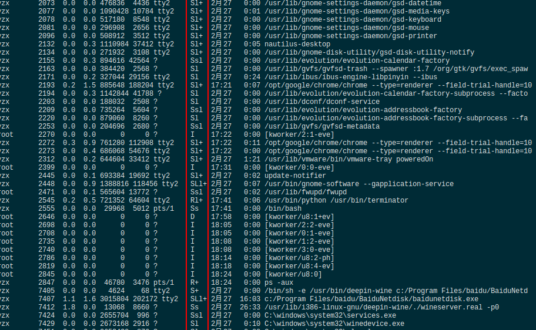
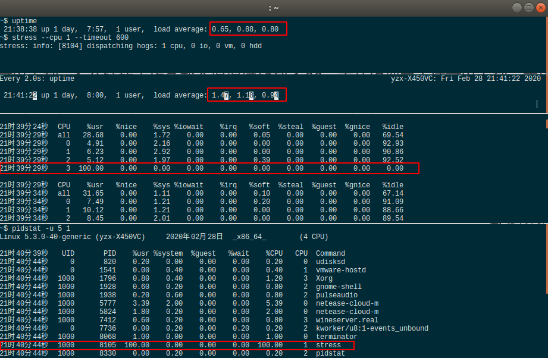
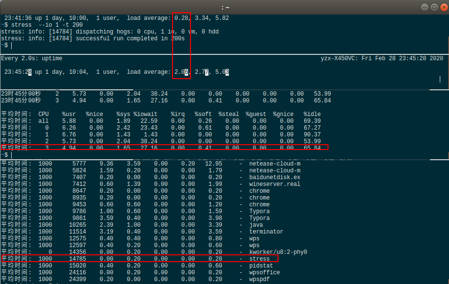
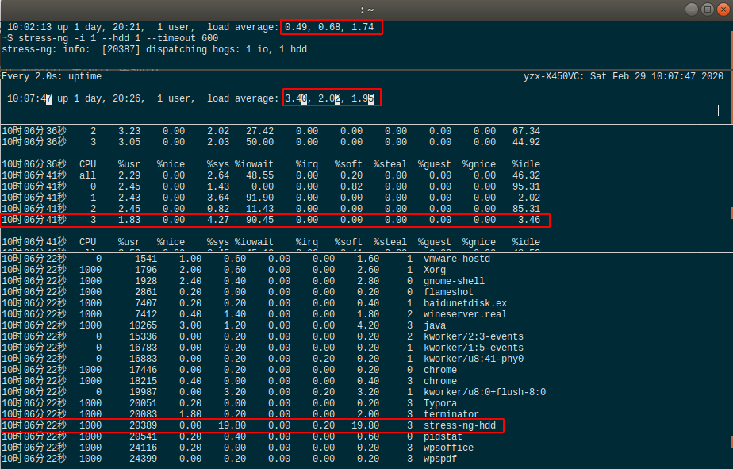

## 前言

每次系统变慢时，可以输入 top 或 uptime 命令，来了解系统的负载情况，如输入 uptime，将得到以下信息：

```shell
$ uptime
 17:41:06 up 1 day,  4:00,  1 user,  load average: 0.78, 0.31, 0.24
```

每列输出的含义如下

```
17:41:06												   // 当前时间
1 day,  4:00		  									 // 系统运行时间
 1 user					 									 // 正在登录的用户数
 load average: 0.78, 0.31, 0.24		  // 过去 1 分钟、5 分钟、15 分钟的平均负载
```

那么什么是平均负载呢？

## 平均负载

简单而言，平均负载是指单位时间内，系统处于可运行状态和不可中断状态的平均进程数，即平均活跃进程数，它和 CPU 使用率没有直接关系。

#### 可运行状态进程

指正在使用 CPU 或正在等待 CPU 的进程，可通过 ps 命令查看处于 R 状态（running/runable）的进程。

<div align="center" ></img></div>
#### 不可中断状态的进程

指正处于内核态关键流程中的进程，并且这些流程时不可打断的，如最常见的等待硬件设备的 I/O 响应，可通过 ps 命令查看处于 D 状态（Uninterruptible Sleep，即 Disk Sleep）的进程。

不可中断状态实际上是系统对进程和硬件设备的一种保护机制。比如，当一个进程向磁盘读写数据时，为了保证数据的一致性，在得到磁盘回复前，它是不能被其他进程或中断信号打断的，此时的进程就处于不可中断的状态，如果此时的进程被打断了，就容易出现磁盘数据与进程数据不一致的问题。

因此，可将平均负载理解成单位时间内的平均活跃进程数（实际上是活跃进程数的指数衰减平均值）。

既然如此，那么最理想的，就是每个 CPU 上都刚好运行着一个进程，这样每个 CPU 都得到了充分利用，比如当平均负载是 2 时意味着什么呢？

- 在双 CPU 的系统上，意味着所有 CPU 都被占用。
- 在四 CPU 的系统上，意味着 CPU 有 50% 的空闲。
- 在单 CPU 的系统上，意味着有一半的进程竞争不到 CPU。

#### 平均负载多少合适？

多少平均负载算高，多少平均负载算低呢？从上面介绍可知道，**平均负载理想情况下等于 CPU 个数，所以评判平均负载时，要先知道系统有几个 CPU。** 可通过 top 命令或从`/proc/cpuinfo`中读取。

```shell
$ cat /proc/cpuinfo |grep 'processor' |wc -l
4
$ grep 'model name' /proc/cpuinfo | wc -l
4
```

前面通过 uptime 可查出过去 1 分钟、5 分钟、15 分钟的平均负载，那么应该看哪个呢。其实都要看，

- 如果三个数值基本相差不大，说明系统负载平衡。
- 如果 1 分钟的值远小于 15 分钟的值，就说明系统系统最近 1 分钟的负载在减少，而过去 15 分钟内却有很大的负载。
- 相反，如果最近 1 分钟的值远大于 15 分钟的值，说明最近 1 分钟的负载在增加，需要观察是否会持续到超出 CPU 个数从而发生过载的情况。

在实际生产环境中，当平均负载高于 CPU 数量 70% 时，需要分析排查负载高原因并及时将之减低。当然 70 % 并不是绝对，比较稳健的做法是持续监控平均负载，当发现它存在明显升高趋势如翻倍时，才去分析调查。

#### 平均负载与 CPU 利用率

平均负载是指单位时间内，系统处于可运行状态和不可中断状态的平均进程数，即平均活跃进程数，所以它不仅包含正在使用 CPU 的进程，还包括等待 CPU 和等待 I/O 的进程。

而 CPU 利用率是指单位时间内 CPU 繁忙情况的统计，和平均负载不完全以对应。比如：

- CPU 密集型进程，使用大量 CPU 会导致平均负载升高，此时两者是一致的。
- I/O 密集型进程，等待 I/O 也会i导致平均负载升高，但是 CPU 使用率不一定很高。
- 大量等待 CPU 的进程调度也会导致平均负载升高，此时 CPU 使用率也会升高。

## 案例分析

### 准备

实验中需要用到 stress 和 sysstat。

```shell
& sudo apt install stress sysstat
```

- stress：是一个 Linux 系统压力测试工具，用于
- sysstat：包含常用的 Linux 性能工具，用于监控和分析系统的性能，下面的案例将使用到 mpstat 和 pidstat 命令。
  - mpstat：一个常用的多核 CPU 性能分析工具，用于实时查看每个 CPU 的性能指标，以及所有 CPu 的平均指标。
  - pidstat：一个常用的进程性能分析工具，用于实时查看进程的 CPU、内存、I/O 以及上下文切换等性能指标。e8e8e8

### 场景一：CPU 密集型

为了占用 CPU，需要使用到 stress 的`--cpu`参数，查看帮助文档将看到

```shell
-c, --cpu N
              spawn N workers spinning on sqrt()
```

这样看来 stress 会开工作线程去执行开方运算。再来看看涉及到四个终端命令，如下所示

```shell
# 终端1，模拟 CPU 使用 100 场景
$ stress --cpu 1 --timeout 600

# 终端2，使用 uptime 查看平均负载变化，-d 参数表示高亮显示变化区域
$ watch -d uptime

# 终端3，运行 mpstat 查看 CPU 使用率变化情况
# -P ALL 表示监控所有 CPU，后面的数字表示间隔 5 秒后输出一组数据
$ mpstat -P ALL 5

# 终端3，运行 pidstat 查看进程 CPU、I/O
# 间隔 5 秒输出一次数据
$ pidstat -u 5 1
```

为了直观显示，使用 terminator 切分窗口

<div align="center" ></img></div>
从第二个窗口可见，最近 1 分钟的平均负载慢慢增加到 1.47，从第三个窗口可见，正好有一个 CPU 的使用率是 100%，但是 iowait 是 0，这说明平均负载升高是因为 CPU 利用率飙高。为了找出是哪个进程导致了 CPU 的使用率是 100%，在第四个窗口中使用了 pidstat，可明显看到 stress 进程的 CPU 利用率为 100%。

### 场景二：I/O 密集型进程

这次需要模拟 I/O 压力，为此使用了 stress 的 `-i` 参数，通过 man 看帮助文档，将看到

```shell
-i, --io N
              spawn N workers spinning on sync()
```

意思是让几个工作线程不停执行 sync() 函数，说到这个函数，不得不提 sync 命令。

Linux 系统中欲写入硬盘的资料有的时候会为了效率起见，会写到 `filesystem buffer` 中，这个 buffer 是一块内存空间，如果欲写入硬盘的资料存于此 buffer 中，而系统又突然断电的话，那么资料就会流失了，sync 指令会将存于 buffer 中的资料强制写入硬盘中。

再回来看看这个过程主要命令有

```shell
# 终端1，开一个工作线程每隔 600 秒执行一次 sync()，即磁盘写入操作
$ stress -i 1 --timeout 600

# 终端2，使用 uptime 查看平均负载变化，-d 参数表示高亮显示变化区域
$ watch -d uptime

# 终端3，运行 mpstat 查看 CPU 使用率变化情况
# -P ALL 表示监控所有 CPU，后面的数字表示间隔 5 秒后输出一组数据
$ mpstat -P ALL 5 1

# 终端3，运行 pidstat 查看进程 CPU、I/O
# 间隔 5 秒输出一次数据
$ pidstat -u 5 1
```

来实战下这个过程，截图如下

<div align="center" ></img></div>
可以看到，最近 1 分钟的平均负载增加到了 2。06，iowait 升到了 22.59%，但 CPU 使用率只到 5.88%，这说明平均负载的升高很可能是因为 iowait 的升高，至于是由于哪个进程引起的，通过 pidstat 并不能很好地体现。原因可能是对于新安装的机器，缓冲区可能比较小，无法产生大的 I/O 压力，为此引入 stress-ng

```shell
# --hdd 表示写临时文件
$ stress-ng -i 1 --hdd 1 --timeout 600
```

再看下实验效果

<div align="center" ></img></div>

可以在第三个窗口看到，存在 iowait 到 90.45% 而 CPU 使用率却是1.83% 的数据，再看 pidstat，存在一行很突出的数据，是由 stress-ng 进程产生的，所以可以基本验证此处平均负载的升高是由 I/O 密集型进程引起的。


