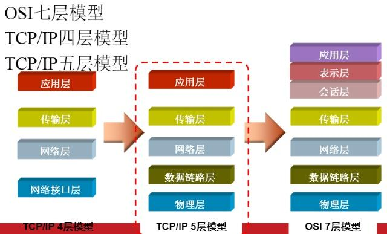
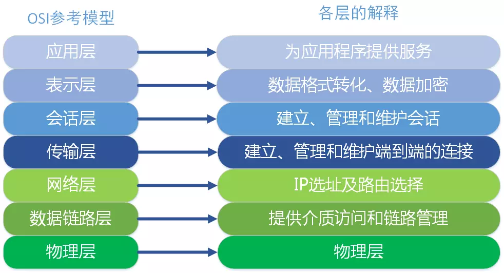
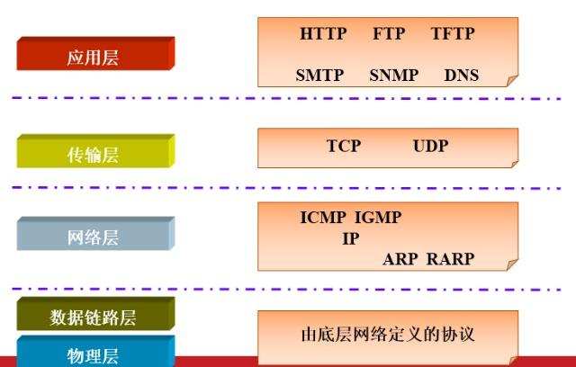

### 从浏览器输入地址按回车经历的网络过程

1. DNS 解析，将域名转换为 IP 地址：浏览器缓存 -> windows hosts 文件 -> 本地域名解析服务器 -> 国家级域名解析服务器 -> 国际顶级域名解析服务器
2. ARP 地址解析，通过广播 ARP 报文确定 IP 地址对应的 MAC 地址

- 浏览器生成 HTTP 请求消息
- 向 `DNS` 服务器查询 Web 服务器的 `IP`地址
- `DNS` 递归查询（www.baidu.com -> baidu.com -> com）
- 委托操作系统协议栈发送消息 （TCP -> IP ->ARP）
- 写入 MAC 报头，拿到路由器地址，查询 ARP 缓存

## 网络模型的层级划分

