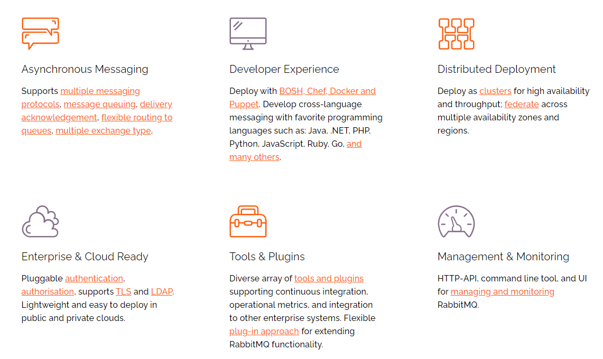

### 1. 消息队列

#### 1.1 什么是消息队列

以下是引百科的对 `MQ` 的定义

> `MQ`（Message Queue）消息队列，是基础数据结构中“先进先出”的一种数据机构。指把要传输的数据（消息）放在队列中，用队列机制来实现消息传递——生产者产生消息并把消息放入队列，然后由消费者去处理。消费者可以到指定队列拉取消息，或者订阅相应的队列，由 `MQ` 服务端给其推送消息。

消息队列是典型的 `生产者-消费者` 模型。生产者不断向消息队列中生产消息，消费者不断的从队列中获取消息。因为消息的生产和消费都是异步的，而且只关心消息的发送和接收，没有业务逻辑的侵入，这样就实现了生产者和消费者的解耦。

#### 1.2 `AMQP` 与 `JMS`

`MQ` 是消息通信的模型，并不是具体实现。在 Java 领域，现在实现 `MQ` 的有两种主流标准：`AMQP`、`JMS`。以下介绍摘自百科：

> `AMQP`，即Advanced Message Queuing Protocol，一个提供统一消息服务的应用层标准高级消息队列协议，是应用层协议的一个开放标准，为面向消息的中间件设计。基于此协议的客户端与消息中间件可传递消息，并不受客户端/中间件不同产品，不同的开发语言等条件的限制。[Erlang](https://baike.baidu.com/item/Erlang) 中的实现有 [RabbitMQ](https://baike.baidu.com/item/RabbitMQ) 等。

> `JMS` 即 Java 消息服务（Java Message Service）应用程序接口，是一个Java平台中关于面向消息中间件（MOM）的 `API`，用于在两个应用程序之间，或分布式系统中发送消息，进行异步通信。Java 消息服务是一个与具体平台无关的 `API`，绝大多数 MOM 提供商都对 `JMS` 提供支持。

常见的 `MQ` 产品有：

- `ActiveMQ`：基于 `JMS`
- `RabbitMQ`：基于 `AMQP`，`erlang` 语言开发，稳定性好
- `RocketMQ`：基于 `JMS`，阿里巴巴产品，目前交由 Apache 基金会管理。
- Kafka：分布式消息系统，高吞吐量

### 2. `RabbitMQ`

`RabbitMQ` 是一个开源的，基于`AMQP` 的完整的可复用的企业级消息系统，支持运行在多种主流操作系统，支持 Java、Python 等多种客户端语言。它具有以下特性：

官方教程：https://www.rabbitmq.com/getstarted.html