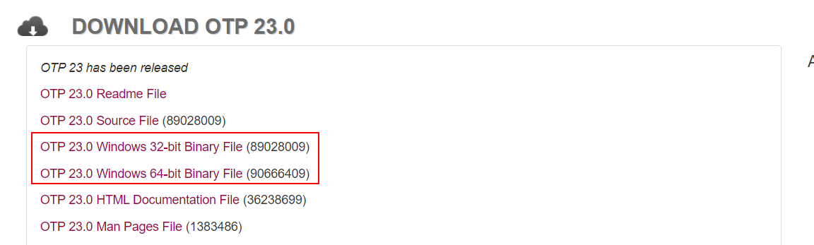
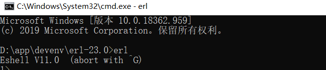
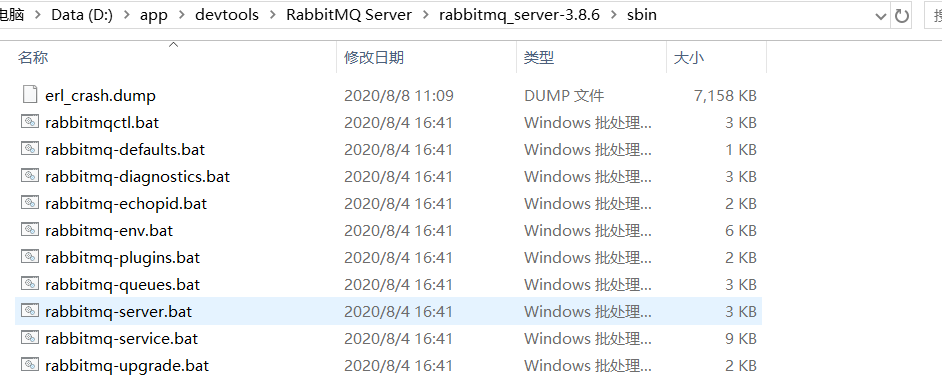
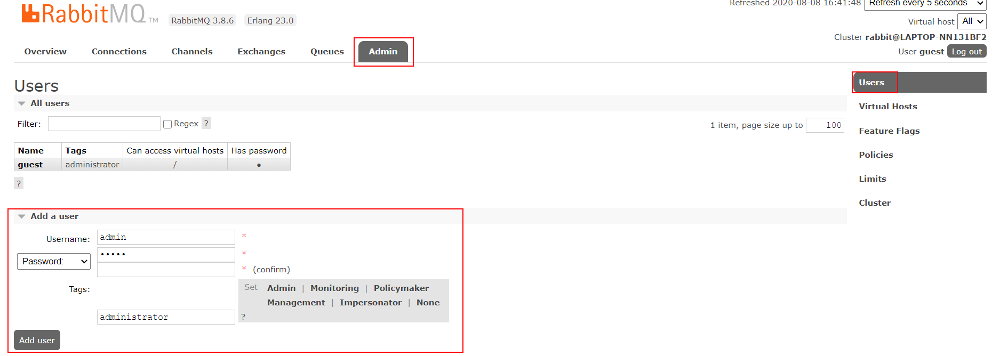
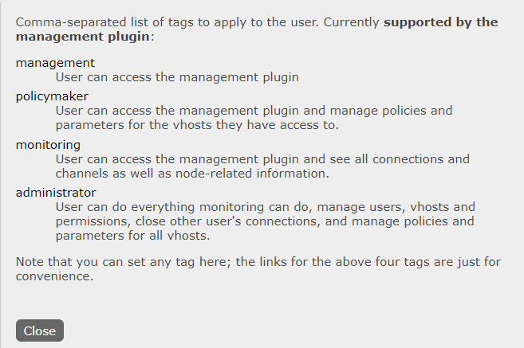
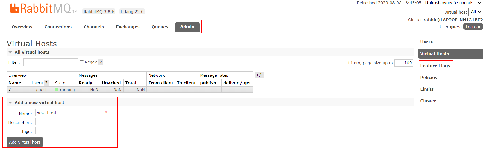
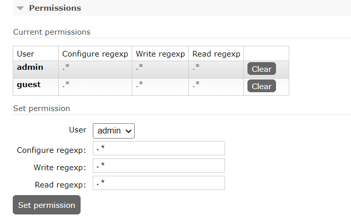
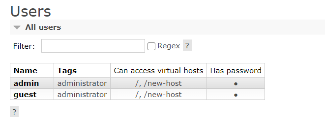

下面介绍如何在 windows 10 下安装 `RabbitMQ`，其实这种关于操作过程的文章需要的时候随便百度都能找到，但还是想记录一下。

#### 1. 下载安装 `erlang`

`RabbitMQ server`是用 `erlang` 编写的，所以需要到 http://www.erlang.org/downloads 去下载安装 `erlang` 。

**需要将安装目录配置到环境变量中去**，假设安装目录为 `D:\app\devenv\erl-23.0`，则需要在系统变量中新建 `ERLANG_HOME` 变量，值为 `D:\app\devenv\erl-23.0`，然后在 `Path` 后面新增 `%ERLANG_HOME%\bin`，

`win+R` 到 `cmd`，输入 `erl` 查看是否显示 `erlang`  版本信息。

#### 2. 下载安装 `RabbitMQ server`

到 [官网下载页](https://www.rabbitmq.com/download.html) 找到 windows 版本的 `RabbitMQ Server` 可执行文件，下载安装。这个过程十分简单，装完之后得到的可执行文件全在一个叫做 `sbin` 的子目录中。

遇到的问题：

- 双击 `rabbitmq-server.bat` 尝试启动，失败，显示端口被占用，`win+r`，输入 `services.msc` 到服务中心，发现有一个叫 `rabbitmq` 的服务已经在运行，怀疑是安装完自动以服务的形式启动了，将之停止，再次双击 `rabbitmq-server.bat` 尝试启动，成功。

- 想通过网页查看和管理 `MQ` 的一些相关配置，访问 http://localhost:15672，显示无法访问，原因是没有开启客户端管理插件，解决方法是进入 `sbin` 目录下输入 `rabbitmq-plugins enable rabbitmq_management` 开启插件，再次尝试访问，响应成功，输入用户信息（guest/guest）成功登录。

  

#### 3. 杂项

##### 3.1 管理界面

- `Connections`：无论生产者还是消费者，都需要与 `RabbitMQ` 建立连接后才可以完成消息的生产和消费，在这里可以查看连接情况。
- `Channels`：通道，建立连接后，会形成通道，消息的投递获取依赖通道。
- `Exchanges`：交换机，用来实现消息的路由。
- `Queues`：队列，即消息队列，消息存放在队列中，等待消费，消费后被移除队列。

##### 3.2 一些端口

- `5672`：`RabbitMQ` 的编程语言客户端连接端口

- `15672`：`RabbitMQ` 管理界面端口

- `25672`：`RabbitMQ` 集群的端口

##### 3.3 权限管理

如果不使用 `guest`，我们也可以自己创建一个用户：

权限标签（Tags）：

1. 超级管理员（Administrator）：可登陆管理控制台，可查看所有的信息，并且可以对用户，策略（policy）进行操作。
2. 监控者（Monitoring）：可登陆管理控制台，同时可以查看 `RabbitMQ` 节点的相关信息（进程数，内存使用情况，磁盘使用情况等）
3. 策略制定者（Policymaker）：可登陆管理控制台, 同时可以对 policy 进行管理。但无法查看节点的相关信息（上图红框标识的部分）。
4. 普通管理者（Management）：仅可登陆管理控制台，无法看到节点信息，也无法对策略进行管理。
5. 其他：无法登陆管理控制台，通常就是普通的生产者和消费者。

##### 3.5 创建 Virtual Hosts

虚拟主机：类似于 `MySQL` 中的 `database`。都是以 “/” 开头。

##### 3.6 设置权限

设置哪些用户可访问该 `virtual host`。

