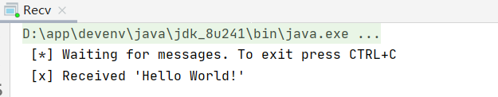

官方英文原文链接：https://www.rabbitmq.com/tutorials/tutorial-one-java.html

### 1. 介绍

`RabbitMQ` 是一个消息中间件，它能接收和转发消息。你可以将它想象成一个邮局，当你将一封想寄的信放进邮箱，你可以确定邮递员最后会将这封信送到收信人的手中，在这个类比中，`RabbitMQ` （或者其中的部件）充当了邮箱、邮局和邮递员的角色。

`RabbitMQ` 和邮局的主要的区别在于它不会处理信纸，它只负责接收、存储和转发消息报文的二进制块。

`RabbitMQ` 的消息传递涉及到一些术语：

- 生产（Producing）：一个发送消息的程序就是一个生产者，用 P 表示。

  

- 消费（Consuming）：一个接收消息的程序就是一个消费者，用 C 表示。

  

- 队列（Queue）：队列类似邮箱，存在于 `RabbitMQ` 内部。尽管消息是流过` RabbitMQ` 和你的应用程序，但是它们只能被存储在 `RabbitMQ` 内部的队列中。队列只受限于主机的内存和磁盘大小，它其实就是一个比较大的消息缓冲。生产者可以将消息发送到队列中，然后消费者可以尝试去从队列中获取是数据，队列用下图表示：

  

注意消费者、生产者和消息队列不需要同在一个主机上，而确实在实际应用中为了实现分布式应用，它们不会被部署在同一个主机上。当然了，一个程序可以同时充当消费者和生产者的角色。

### 2. 使用 Java 客户端

在这部分的教程中，我们用 Java 写两个程序：一个发送一条消息的生产者和一个接收并打印消息的消费者。我们会用 Java `API` 掩盖一些细节，只关注如何快速入门。

下面这幅图用来表示整个通信过程：


为了省事，这里我创建 Maven 工程，并集成 Spring Boot，配置信息如下：

```xml
<?xml version="1.0" encoding="UTF-8"?>
<project xmlns="http://maven.apache.org/POM/4.0.0"
         xmlns:xsi="http://www.w3.org/2001/XMLSchema-instance"
         xsi:schemaLocation="http://maven.apache.org/POM/4.0.0 http://maven.apache.org/xsd/maven-4.0.0.xsd">
    <modelVersion>4.0.0</modelVersion>

    <groupId>com.github.cszxyang</groupId>
    <artifactId>rabbitmq-tutorial</artifactId>
    <version>1.0-SNAPSHOT</version>
    <parent>
        <groupId>org.springframework.boot</groupId>
        <artifactId>spring-boot-starter-parent</artifactId>
        <version>2.0.2.RELEASE</version>
    </parent>
    <dependencies>
        <dependency>
            <groupId>org.springframework.boot</groupId>
            <artifactId>spring-boot-starter-amqp</artifactId>
        </dependency>
    </dependencies>
</project>
```

#### 2.1 消息发送

1. 与 `RabbitMQ Server`  建立连接
2. 声明一条名为 `hello` 的队列，如果该队列不存在则创建它
3. 将内容为 `Hello World!` 的报文发送到上述队列中


```java
package com.github.cszxyang.rt.hw;

import com.rabbitmq.client.Channel;
import com.rabbitmq.client.Connection;
import com.rabbitmq.client.ConnectionFactory;

import java.nio.charset.StandardCharsets;

public class Send {

    private final static String QUEUE_NAME = "hello";

    public static void main(String[] argv) throws Exception {
        ConnectionFactory factory = new ConnectionFactory();
        factory.setHost("localhost");
        try (Connection connection = factory.newConnection();
            Channel channel = connection.createChannel()) {
            channel.queueDeclare(QUEUE_NAME, false, false, false, null);
            String message = "Hello World!";
            channel.basicPublish("", QUEUE_NAME, null, message.getBytes(StandardCharsets.UTF_8));
            System.out.println(" [x] Sent '" + message + "'");
        }
    }
}
```

针对上述代码有下述解释：

- `Connection` 是对套接字连接的抽象，它为我们处理协议版本协商和身份验证等。在这里，我们连接到本地机器上的 `RabbitMQ` 节点——也就是本地主机。如果我们想连接到另一台机器上的节点，我们只需在这里指定它的主机名或 `IP` 地址。

- 接下来，我们创建一个通道，用于完成任务的大部分 `API` 都在这里。注意，我们可以使用 `try-with-resources` 语句，因为连接和通道都实现 `java.io.Closeable`。这样，我们就不需要在代码中显式地关闭它们。

- 要发送，我们必须声明一个要发送到的队列；然后我们可以向队列发布一条消息，所有这些都在 `try-with-resources` 语句中。

- **声明一个队列是幂等的，即只有当它不存在时才会创建它。**消息内容是一个字节数组，因此您可以在其中编码任何内容。
- 如果发送消息失败，可能客户端在启动时没有足够的可用磁盘空间（默认情况下它至少需要200 MB空闲空间），因此拒绝接受消息。检查日志文件，以确认和减少限制，如果有必要。配置文件文档将向你展示如何设置 `disk_free_limit`。

值得注意的是 `queueDeclare` 会帮我们创建队列。通过管理界面可见，此时什么队列也没有。


运行上述程序，发现名为 `hello` 的队列被创建出来了。


并且消息也成功发送了。


再看 `hello` 队列中存在一条消息。


#### 2.2 消息消费

不像上述的生产者发送完一条消息就退出，我们的消费者会一直处于接收消息的状态中。


1. 与 `RabbitMQ Server`  建立连接
2. 声明一条名为 `hello` 的队列，如果该队列不存在则创建它
3. 底层估计使用的是多路复用，设置回调函数打印接受到的消息

```java
package com.github.cszxyang.rt.hw;

import com.rabbitmq.client.Channel;
import com.rabbitmq.client.Connection;
import com.rabbitmq.client.ConnectionFactory;
import com.rabbitmq.client.DeliverCallback;

public class Recv {

    private final static String QUEUE_NAME = "hello";

    public static void main(String[] argv) throws Exception {
        ConnectionFactory factory = new ConnectionFactory();
        factory.setHost("localhost");
        Connection connection = factory.newConnection();
        Channel channel = connection.createChannel();

        channel.queueDeclare(QUEUE_NAME, false, false, false, null);
        System.out.println(" [*] Waiting for messages. To exit press CTRL+C");

        DeliverCallback deliverCallback = (consumerTag, delivery) -> {
            String message = new String(delivery.getBody(), "UTF-8");
            System.out.println(" [x] Received '" + message + "'");
        };
        channel.basicConsume(QUEUE_NAME, true, deliverCallback, consumerTag -> { });
    }
}
```

针对上述代码的补充说明：

- 注意，我们在这里也声明了队列。因为我们可能在启动发布者之前启动消费者，所以我们希望在尝试使用来自该队列的消息之前确保该队列存在。
- 为什么我们不使用 `try-with-resource` 语句来自动关闭通道和连接？通过这样做，我们只需让程序运行以下，关闭所有程序，然后退出！这将很尴尬，因为我们希望在使用者异步侦听消息到达时流程保持活动状态。
- 我们将告诉服务器将队列中的消息传递给我们。因为它将异步地向我们推送消息，所以我们提供了一个对象形式的回调，它将缓冲消息，直到我们准备好使用它们。这就是 `DeliverCallback` 子类所做的。

运行上述程序，可见接收到并打印了消息。



再看管理界面中 `hello` 队列中的消息已经被消费掉了。	

