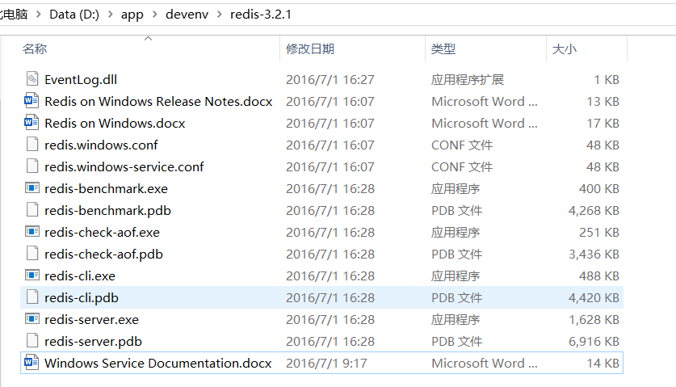
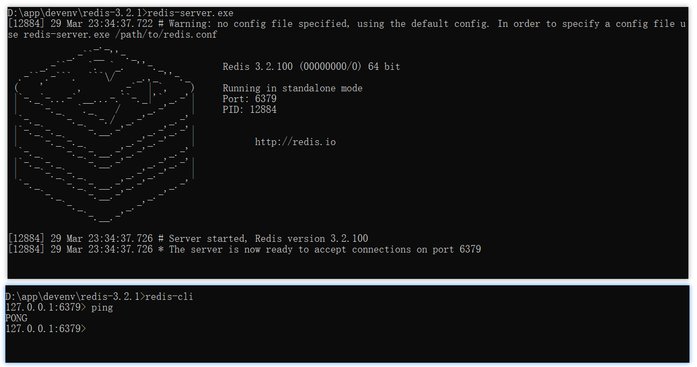
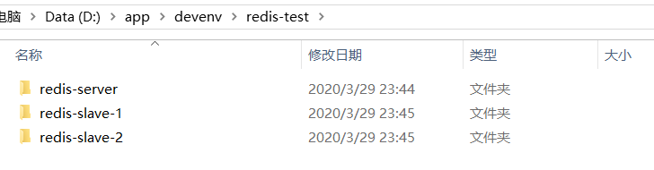
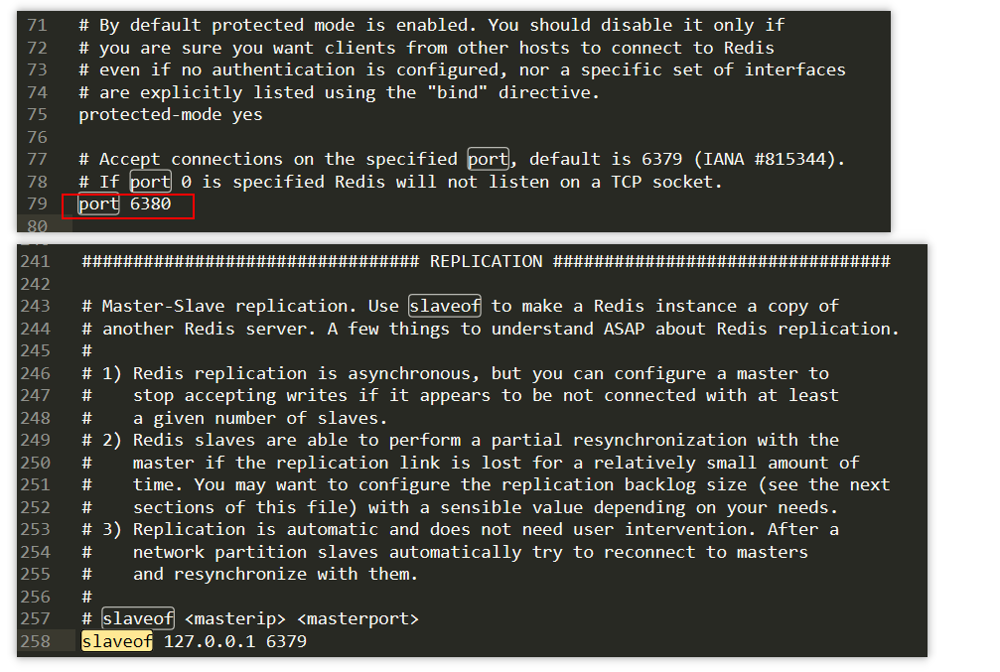
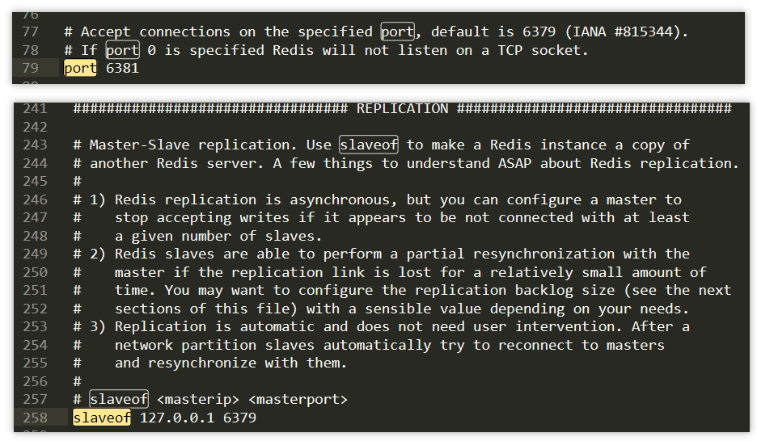
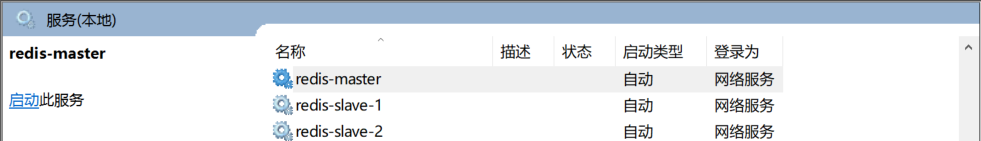
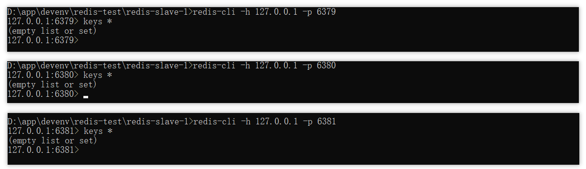
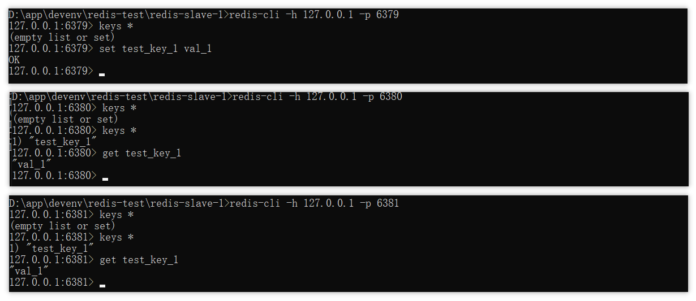
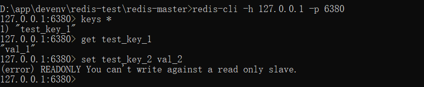

主从模式指的是使用一个 Redis 实例作为主机，其余的实例作为备份机。主机和从机的数据完全一致，主机支持数据的写入和读取等各项操作，而从机则只支持与主机数据的同步和读取，也就是说，客户端可以将数据写入到主机，由主机自动将数据的写入操作同步到从机。主从模式很好的解决了数据备份问题，并且由于主从服务数据几乎是一致的，因而可以将写入数据的命令发送给主机执行，而读取数据的命令发送给不同的从机执行，从而达到读写分离的目的。

## 安装 Redis

- 到 https://github.com/MicrosoftArchive/redis/releases 下载 zip 编译包
- 解压后运行 redis-server 加载配置文件即可启动



> **可选 - 服务化**
>
> 在安装的根目录，使用下面可将 Redis 设为服务
>
> ```shell
> redis-server --service-install redis.windows-service.conf --loglevel verbose
> ```
>
> 相关命令：
>
> - 卸载服务：redis-server --service-uninstall
> - 开启服务：redis-server --service-start
> - 停止服务：redis-server --service-stop
>
> **可选 - 设置密码**‘
>
> 打开`redis-windows-service-conf` 文件，增加配置信息 `requirepass pwd` （pwd 为你的密码）


开启 server，新建客户端并连接测试。



## 主从服务器

直接拷贝 server 目录，得到两个从服务器目录，如下所示



分别修改从服务器的两个配置文件 `redis-windows.conf` 和 `redis-windows-service.conf`。

对于 redis-slave-1，设置其端口为`6380`，并配置`slaveof`选项，使之成为主服务器（同样在本机，端口为 6379）。



类似地，对于 redis-slave-2，设置其端口为`6381`，并配置`slaveof`选项，使之成为主服务器（同样在本机，端口为 6379）。



### 可选 - 服务化

进入各自服务器主目录，输入下面命令

```shell
redis-server --service-install redis.windows.conf --loglevel verbose  --service-name 服务名称
```

win+r 后输入 `services.msc` 查看服务列表



### 测试

状态一：所有服务器均无数据。



状态二：在 master 服务器中新增一个键值对，发现其他两个从服务器实例y已经同步了数据。



状态三：尝试在从服务器 `slave-1` （注意端口）中增加键值对，报错。

