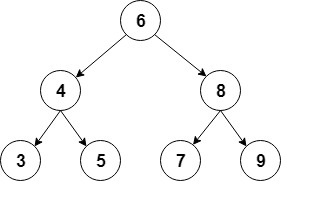
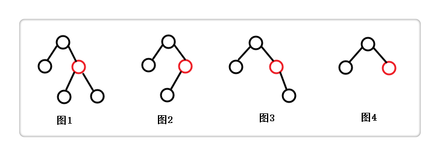
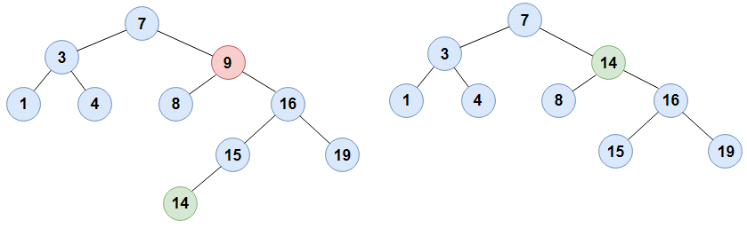

## 结构

二叉搜索树（BST, Binary Searching Tree）也称为二叉查找树、有序二叉树（ordered binary tree）或排序二叉树（sorted binary tree），是指一棵空树或者具有下列性质的二叉树：

1. 若任意节点的左子树不空，则左子树上所有节点的值均小于它的根节点的值；
2. 若任意节点的右子树不空，则右子树上所有节点的值均大于它的根节点的值；
3. 任意节点的左、右子树也分别为二叉查找树；
4. 没有键值相等的节点。



二叉查找树相比于其他数据结构的优势在于查找、插入的时间复杂度较低。为 O(log n)。二叉查找树是基础性数据结构，用于构建更为抽象的数据结构，如集合、多重集、关联数组等。

二叉查找树的查找过程和次优二叉树类似，通常采取`二叉链表`作为二叉查找树的存储结构。中序遍历二叉查找树可得到一个关键字的有序序列，一个无序序列可以通过构造一棵二叉查找树变成一个有序序列，构造树的过程即为对无序序列进行查找的过程。每次插入的新的结点都是二叉查找树上新的叶子结点，在进行插入操作时，不必移动其它结点，只需改动某个结点的指针，由空变为非空即可。搜索、插入、删除的复杂度等于树高，期望 O(log n)，最坏  O(n)（数列有序，树退化成线性表）。

虽然二叉查找树的最坏效率是 O(n)，但它支持动态查询，且有很多改进版的二叉查找树可以使树高为 O(log n)，从而将最坏效率降至 O(log n)，如AVL树、红黑树等。二叉搜索树的Java数据结构定义如下：

```java
// 根结点
private TreeNode root;
// 二叉树结点类定义
private static class TreeNode {
    int val;
    TreeNode left;
    TreeNode right;
    TreeNode(int val) { this.val = val; }
}
```

其中使用静态内部类`TreeNode`抽象表示二叉搜索树中的结点，同时将结点的数据定义为整型，当然如果要考虑扩展性，可以将之设定为`Comparable`类型，这样可以将任何一种的实现`Comparable`接口的类型数据作为`val`的类型，只需提供正确的`compareTo()`方法即可。

## 基本操作

### 1. 插入元素

使用递归的方法向`current`结点下插入一个值为`val`的结点，逻辑是通过判断`val`与当前结点`current`的元素值来决定插入的位置，由于不考虑元素值重复的情况，所以如果`val == current.val`则直接返回，当然如果需要考虑重复结点，可在`TreeNode`中设置`count`域，视应用场景而定。

```java
/**
 * 递归添加元素
 * @param current 当前结点
 * @param val 结点值
 * @return 插入值后的当前结点
 */
private TreeNode addRecursively(TreeNode current, int val) {
    if (current == null) return new TreeNode(val);
    if (val < current.val) {
        current.left =  addRecursively(current.left, val);
    } else if (val > current.val) {
        current.right =  addRecursively(current.right, val);
    } else {
        return current;
    }
    return current;
}
```

下面是添加结点的公开接口，默认从根结点开始添加，可以看到上面的函数中首先判断当前结点是否为空，若空则返回一个独立的结点到上一层调用点，若上一层调用点是下面的`add()`则表示当前树为空，则将返回的结点设为根结点；若上一层调用点是上面的`addRecursively()`则表示插入位置为叶子结点的子结点，于是通过递归返回，逐层更新插入结点后的子树。

```java
/**
 * 往二叉树中添加值为val的结点
 * @param val 待添加结点的值
 */
public void add(int val) {
    TreeNode node = addRecursively(root, val);
    if (root == null) {
        root = node;
    }
}
```

### 2. 判存

递归判断二叉搜索树中是否存在一个元素值为`val`的结点，如果存在则返回`true`，实质上是一个递归搜索的过程，也是通过比较结点值决定递归传参。同样地，判断的起点也是根结点，提供公开方法`contains()`。

```java
/**
 * 递归判断当前结点下有没值为val的结点
 * @param current 当前结点
 * @param val 目标值
 * @return 含有返回true
 */
private boolean containsRecursively(TreeNode current, int val) {
    if (current == null) return false;
    if (val == current.val) return true;
    return val < current.val ? containsRecursively(current.left, val)
        		: containsRecursively(current.right, val);
}

/**
 * 对外接口，判断二叉树中是否含有值为val的结点
 * @param val 目标值
 * @return 含有返回true
 */
public boolean contains(int val) { return containsRecursively(root, val); }
```

### 3. 删除结点

递归删除二叉树中`current`结点下值为`val`的结点，首个判断的分析类似插入结点函数`addRecursively()`，通过比较`val`与左右子结点的大小决定递归的调用，一共分为4种情况



- 要删除的结点存在左右孩子，如图一所示
- 要删除的结点仅存在左孩子，如图二所示
- 要删除的结点仅存在右孩子，如图三所示
- 要删除的结点没有孩子。如图四所示

对于图二，图三，图四这三种情况，实现很容易。我们重点说下图一的情况。首先我们要明确一条定理：**二叉查找树的中序遍历序列是升序序列。**因此对于图一的情况，我们采取的策略就是，找到要删除结点（在中序遍历中）的后继，用后继替换要删除的结点，而后继自然是当前结点的右子树中的最小结点



如上图所示，待删除的是值为9的结点`node`，其左右子结点均不为空，则先沿着它的右子树的左子树找到最小的替代，即值为14的结点，将之取代`node`的位置。

```java
private TreeNode deleteRecursive(TreeNode current, int val) {
    if (current == null) return null;

    if (val == current.val) {
        // 左右结点皆为空
        if (current.left == null && current.right == null) return null;

        // 右子结点为空，则当前结点删除后，左子结点上升到当前结点位置
        if (current.right == null) return current.left;
        // 左子结点为空，则当前结点删除后，右子结点上升到当前结点位置
        if (current.left == null) return current.right;

        // 左右子结点均不空，则右子结点中最小的结点成为当前结点
        // 删除时，先将右子结点中最小的结点的值作为当前结点的值，
        // 再在右子树中删除最小值结点
        int smallestValue = findSmallestValue(current.right);
        current.val = smallestValue;
        current.right = deleteRecursive(current.right, smallestValue);
        return current;
    }

    // 递归往左右子树查找删除，并更新左右子树
    if (val < current.val)  current.left = deleteRecursive(current.left, val);
    else current.right = deleteRecursive(current.right, val);
    return current;
}
```

下面是查找最小的元素结点函数`findSmallestValue()`，以及在二叉搜索树中删除结点的公开接口`delete()`。

```java
/**
 * 往左子树中找到二叉树中的最小结点值
 * @param root 根结点
 * @return 最小结点值
 */
private int findSmallestValue(TreeNode root) {
    return root.left == null ? root.val : findSmallestValue(root.left);
}

/**
 * 对外公开接口，删除二叉树中值为val的结点
 * @param val 结点值
 */
public void delete(int val) { deleteRecursive(root, val); }
```

### 4. 求树的最大深度

通过递归方法，从最底层结点开始算起，通过比较子树深度，取其中的最大值并逐层累加子树最大深度，最后得到整棵二叉搜索树的最大深度。

```java
public int maxDepth() {
    return maxDepthRecursively(root);
}

private int maxDepthRecursively(TreeNode root) {
    if(root == null) return 0;
    return Math.max(maxDepthRecursively(root.left), 
                    maxDepthRecursively(root.right)) + 1;
}
```

### 5. 搜索与遍历

二叉搜索树的遍历实质上是一个搜索逐渐搜索的过程，而其搜索方法主要分为两种，即`广度优先搜索（BFS，Breadth-First-Search）`和`深度优先搜索（DFS，Depth-First-Search）`。

#### 5.1 广度优先搜索

广度优先搜索从树的根结点开始，在检查下一层的结点之前检查同一层的所有结点，


二叉树的`层次遍历`就是利用这种思想。在层次遍历中，当前层先访问的结点，在进行下一层的访问时其左右孩子也先被访问，这符合队列`先进先出`的特点。因此在进行层次遍历时，可使用一个辅助队列存储当前层的被访问过的结点，其具体步骤如下

- 将根结点入队
- 当队列不空时，重复下列操作
  - 访问队头结点，并将其删除
  - 若其有左孩子，则将其左孩子入队
  - 若其有右孩子，则将其右孩子入队

其实现如下`traverseLevelOrder()`函数所示

```java
public void traverseLevelOrder() {
    if (root != null) {
        Queue<TreeNode> nodes = new LinkedList<>();
        nodes.add(root);
        while (!nodes.isEmpty()) {
            TreeNode node = nodes.remove();
            System.out.print(" " + node.val);、
            if (node.left != null) nodes.add(node.left);
            if (node.right != null) nodes.add(node.right);
        }
    }
}
```

#### 5.2 深度优先搜索

深度优先搜索从根结点开始，并沿着一个特定的分支向下搜索，展开子结点并沿着同样的路径向下，直到搜索索到达死胡同，即该路径下无含有子结点的结点时，搜索才会回溯到它上次遇到的结点，如果该结点的子结点没有被完全检查。则按照另一条路径继续搜索，下面是利用深度优先搜索算法先序查找二叉搜索树中某结点的示例动图：


使用递归的方法，很容易就能实现二叉搜索树的深度优先遍历

```java
/**
 * 中序深度优先遍历
 * @param node 开始遍历的结点
 */
public void traverseInOrder(TreeNode node) {
    if (node != null) {
        traverseInOrder(node.left);
        System.out.print(" " + node.val);
        traverseInOrder(node.right);
    }
}

/**
 * 前序深度优先遍历
 * @param node 开始遍历的结点
 */
public void traversePreOrder(TreeNode node) {
    if (node != null) {
        System.out.print(" " + node.val);
        traversePreOrder(node.left);
        traversePreOrder(node.right);
    }
}

/**
 * 后序深度优先遍历
 * @param node 开始遍历的结点
 */
public void traversePostOrder(TreeNode node) {
    if (node != null) {
        traversePostOrder(node.left);
        traversePostOrder(node.right);
        System.out.print(" " + node.val);
    }
}
```

与广度优先搜索不同，深度优先搜索不能保证找到具有最短路径的解决方案。由于深度优先搜索可以沿着一个无限长的分支进行下去，而不必返回到其他分支，因此即使存在最短路径解决方案，也不能保证深度优先搜索一定能找到解决方案。深度优先搜索的内存需求比广度优先搜索的内存需求要低，只需要存储从根结点到当前结点的单个路径，以及路径上任何未展开的结点。


