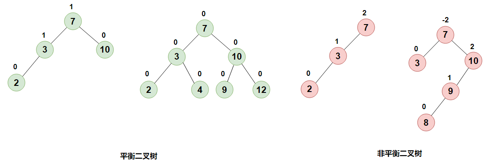
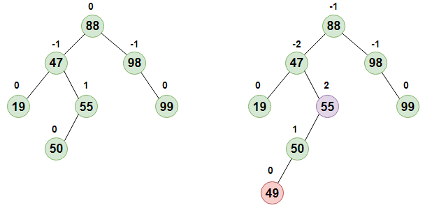
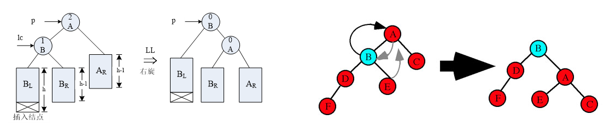
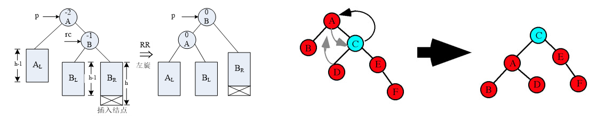
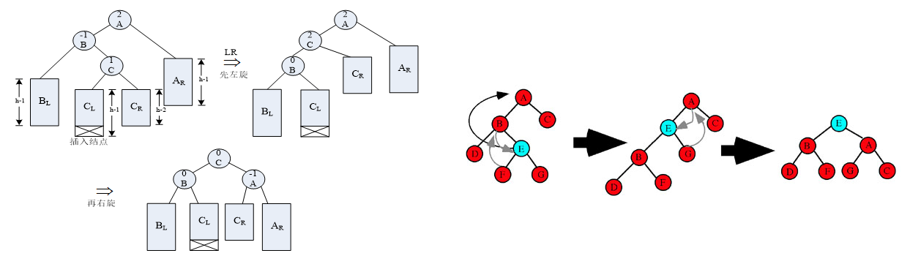
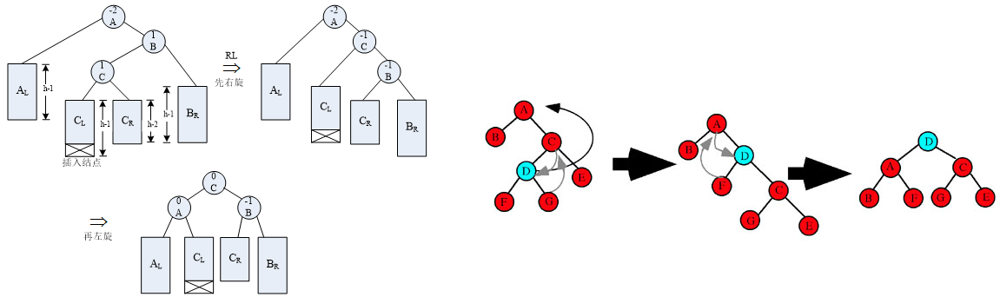

## 定义

对于二叉查找树，当其高度最小时，其查找性能最优，虽然满二叉树和完全二叉树的高度都是最小的，但是在在插入或删除结点后维持其高度最小的代价较大。平衡二叉查找树是一种可兼顾查找与维护性能的折中方案。

平衡二叉查找树又称AVL树，得名于它的发明者Adelson-Velsky和Landis，他们在1962年的论文《An algorithm for the organization of information》中公开了这一数据结构。



平衡二叉树是具有以下性质的二叉查找树：它的左子树和右子树都是平衡二叉树，且左子树和右子树的高度差的绝对值不超过1。结点的**平衡因子**是它的左子树的高度减去它的右子树的高度（有时相反）。带有平衡因子1、0或 -1的结点被认为是平衡的。带有平衡因子-2或2的结点被认为是不平衡的，并需要重新平衡这棵树。平衡因子可以直接存储在每个结点中，或从可能存储在节点中的子树高度计算出来。

平衡二叉树的结点类型如下所示，其中属性`height`表示子树的高度，用于计算`平衡因子`。

```java
private class Node {
    private final Key key;   // the key
    private Value val;       // the associated value
    private int height;      // height of the subtree
    private int size;        // number of nodes in subtree
    private Node left;       // left subtree
    private Node right;      // right subtree

    public Node(Key key, Value val, int height, int size) {
        this.key = key;
        this.val = val;
        this.size = size;
        this.height = height;
    }
}
```

 

## 操作

平衡二叉树上的查找过程与二叉查找树的查找过程相同，且可以证明在平衡二叉树上进行查找时，所进行的值的比较次数是和 logn 同数量级的。而平衡二叉树的插入和删除过程都有可能破坏其平衡二叉树的特性，若失衡则需调整，令其重新满足平衡二叉树的定义。

### 1. 查找

通过公共方法`get`，调用私有实现，从根结点开始搜索键为`key`的结点对应的值`value`，若`key`为空则抛出异常。而私有实现的逻辑则是普通的二叉搜索树的用递归实现的后序深度优先搜索。

```java
/**
 * Returns the value associated with the given key.
 * @param key the key
 * @return  the valie
 * @throws IllegalArgumentException if {@code key} is {@code null}
 */
public Value get(Key key) {
    if (key == null) throw new IllegalArgumentException("argument to get() is null");
    Node x = get(root, key);
    if (x == null) return null;
    return x.val;
}

/**
 * Returns value associated with the given key in the subtree or
 * {@code null} if no such key.
 * 
 * @param x the subtree
 * @param key the key
 * @return value associated with the given key in the subtree or
 *         {@code null} if no such key
 */
private Node get(Node x, Key key) {
    if (x == null) return null;
    int cmp = key.compareTo(x.key);
    if (cmp < 0) return get(x.left, key);
    else if (cmp > 0) return get(x.right, key);
    else return x;
}
```

### 2. 插入

在平衡二叉查找树中插入一个新的结点后，从该结点起向上通过判断平衡因子，寻找第一个不平衡的结点，以确定该树是否失衡。若找到，则以该结点为跟的子树被称为`最小失衡子树`，如下图所示，当新插入结点 49 后，以 55 为根结点的子树即为最小失衡子树。



#### 2.1 失衡调整

当新插入结点导致失衡时，若将最小失衡子树调整为平衡的子树且高度与插入前的高度相同，则整棵树可恢复平衡且无需调整其他结点，对最小失衡子树的调整操作可以归纳为下面四种类型，分别为RR型、LL型、LR型、RL型，这几种情况都涉及了树的旋转操作，而树的旋转操作又分为左旋和右旋，它们互为逆变换。


##### (1) LL型

指在最小失衡子树的`左孩子的左子树`上插入了新的结点。失衡调整如下图左侧所示，先找到最小失衡子树的根A，以其左孩子结点B为轴对不平衡结点A进行顺时针旋转（即右旋）。右旋是让B顶替A的位置，并置A为B的右孩子，如果B存在右子树B<sub>R</sub>，则置B<sub>R</sub>为A的左子树。 



更加直观的图见上图右侧的示例，右旋操作的代码实现如下所示，其中p是最小失衡子树的根结点，调整后其左孩子成为新的根，将之返回即可。

```java
/**
 * Rotates the given subtree to the right.
 * 
 * @param p the subtree
 * @return the right rotated subtree
 */
private Node rotateRight(Node p) {
    Node k = p.left;
    p.left = k.right;
    k.right = p;
    k.size = p.size;
    p.size = 1 + size(p.left) + size(p.right);
    p.height = 1 + Math.max(height(p.left), height(p.right));
    k.height = 1 + Math.max(height(k.left), height(k.right));
    return k;
}
```

##### (2) RR型

指在最小失衡子树的`右孩子的右子树`上插入了新的结点，正好与LL型对称，对以A为根的最小失衡子树进行逆时针旋转（即左旋）。




更加直观的图见上图右侧的示例，右旋操作的代码实现如下所示，其中p是最小失衡子树的根结点，调整后其右孩子成为新的根，将之返回即可。

```java
/**
 * Rotates the given subtree to the left.
 * 
 * @param p the subtree
 * @return the left rotated subtree
 */
private Node rotateLeft(Node p) {
    Node k = p.right;
    p.right = k.left;
    k.left = p;
    k.size = p.size;
    p.size = 1 + size(p.left) + size(p.right);
    p.height = 1 + Math.max(height(p.left), height(p.right));
    k.height = 1 + Math.max(height(k.left), height(k.right));
    return k;
}
```

##### (3) LR型

指在最小失衡子树的左孩子的右子树插入新结点后导致的失衡状态，处理的方法如下图所示，首先找到以A为根的最小失衡子树，以该子树的左孩子结点B为轴对右子树结点C进行左旋调整，使树型形成LL型。再以C为轴，对不平衡结点A进行右旋调整。在算法实现上，需依次调用左旋处理和右旋处理以实现双旋处理。



##### (4) RL型

和LR型正好对称，需依次进行右旋处理和左旋处理



结合上面的四种情况，对于二叉平衡树失衡后的调整逻辑，不难写出下面的实现。

```java
private Node balance(Node x) {
    if (balanceFactor(x) < -1) {    
        // RL型，先对右子树右旋，变成RR型
        if (balanceFactor(x.right) > 0)  x.right = rotateRight(x.right);
        // RR型，对根左旋
        x = rotateLeft(x);
    }
    else if (balanceFactor(x) > 1) {
        // LR型，先以左孩子为轴对右子树左旋，变成LL状态
        if (balanceFactor(x.left) < 0)  x.left = rotateLeft(x.left);
        // LL型，对根右旋
        x = rotateRight(x);
    }
    return x;
}
```

#### 2.2 AVL的插入

下面是公共的的平衡二叉树插入接口，首先键不允许存在空键的键值对，其次，当入参的键值对中`val`为空时，将`key`对应的结点删除；当树中含有相应键的结点时，将结点中原来的值用新值覆盖掉。最后需要对插入结点后的平衡二叉树进行平衡操作。并检查是否满足平衡二叉的特点。

```java
public void put(Key key, Value val) {
    if (key == null)
        throw new IllegalArgumentException("first argument to put() is null");
    if (val == null) {
        delete(key);
        return;
    }
    root = put(root, key, val);
    asset check();
}
```

下面是插入结点的具体实现，包括对失衡构造平衡二叉树，可采用依次插入结点的方式进行，参考《数据结构》，其递归步骤如下

- 若是空树，则插入结点作为根结点，树的高度增加1。
- 若待插入结点和根结点相等，则覆盖其原来的值。
- 若待插入结点小于根结点，且在左子树中也不存在相等的结点，则在左子树插入，且若插入后的左子树高度增加1，则分情况处理
  1. 原根结点的平衡因子为-1（右子树高于左子树），则其平衡因子更改为0，树的高度不变；
  2. 原根结点的平衡因子为0（左右子树高度相等），则其平衡因子修改为1，树的高度增加1；
  3. 原根结点的平衡因子为1（左子树高于右子树）：
     - 若插入后左子树根结点的平衡因子为1（则原根结点的平衡因子应变为2），则属于LL型，需进行右旋平衡调整，并在调整后将根结点及其右孩子的平衡因子更改为0，树的高度不变；
     - 若插入后左子树根结点的平衡因子为-1（原根结点的平衡因子应变为2），则属于LR型，需进行先向左、后向右的双向旋转平衡调整，并在调整后修改根结点和其左、右孩子的平衡因子，树的高度不变； 
- 若待插入结点大于根结点，且在右子树中不存在相等的结点，则在右子树插入，且当插入之后的右子树高度加1时，则分情况处理：
  1. 原根结点的平衡因子是1（左子树高于右子树），则其平衡因子修改为0，树的高度不变；
  2. 原根结点的平衡因子是0（左右子树高度相等），则其平衡因子修改为-1，树的高度加1；
  3. 原根结点的平衡因子为-1（右子树高于左子树）：
     - 插入后右子树根结点的平衡因子为1（则原根结点的平衡因子应变为-2），则属于RL型，需要进行两次处理，第一次先右旋平衡调整，再左旋平衡调整，并且在旋转处理之后，修改根结点和其左、右子树根结点的平衡因子，树的高度不变；
     - 若插入后右子树根结点的平衡因子为-1（则原根结点的平衡因子应变为-2），则属于RR型，需要进行一次左旋处理，并且在左旋之后，更新根结点和其左、右子树根结点的平衡因子，树的高度不变。

可以看到插入结点的步骤分了三层，其中二三层的判断实质上是失衡调整的策略，这在上面的`balance()`函数中已经实现了，所以只需实现第一层的逻辑，然后在插入结点后，在调用`balance()`函数对二叉查找树分情况进行调整。

```java
private Node put(Node x, Key key, Value val) {
    // 空树/叶子结点，直接返回一个新结点
    if (x == null) return new Node(key, val, 0, 1);
    int cmp = key.compareTo(x.key);
    if (cmp < 0) {  // 插入到左子树
        x.left = put(x.left, key, val);
    }
    else if (cmp > 0) { // 插入到右子树
        x.right = put(x.right, key, val);
    }
    else {  // 键相同，覆盖原来的值
        x.val = val;
        return x;
    }
    x.size = 1 + size(x.left) + size(x.right);
    x.height = 1 + Math.max(height(x.left), height(x.right));
    return balance(x);
}
```

### 3. 删除

下面是二叉平衡树删除结点的公共方法，首先与插入结点一样，对`key`判空，如果树中不存在`keu`对应的结点，则结束；主要的逻辑在私有实现`delete(root, key)`中。

```java
public void delete(Key key) {
    if (key == null) throw new IllegalArgumentException("argument to delete() is null");
    if (!contains(key)) return;
    root = delete(root, key);
    asset check();
}
```

首先通过比较与递归调用找到待删除的结点，然后进行判断、删除、后续处理等操作，其实与[二叉查找树树删除结点](../construction_common_operaton/#3-删除结点)的逻辑差不多，只是需要额外维护高度与容量这两个属性，以及对平衡二叉树的性质进行维护。

```java
private Node delete(Node x, Key key) {
    int cmp = key.compareTo(x.key);
    if (cmp < 0) x.left = delete(x.left, key);
    else if (cmp > 0) x.right = delete(x.right, key);
    else {
        if (x.left == null) return x.right;
        else if (x.right == null) return x.left;
        else { 
            // 左右都不空，先找到当前待删除结点的右子树的最小结点x
            // 并将x上移到当前待删除结点的位置
            Node y = x;
            x = min(y.right);
            x.right = deleteMin(y.right);
            x.left = y.left;
        }
    }
    x.size = 1 + size(x.left) + size(x.right);
    x.height = 1 + Math.max(height(x.left), height(x.right));
    return balance(x);
}
```
