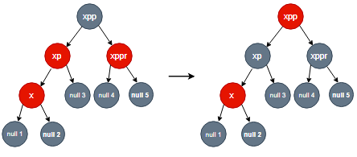
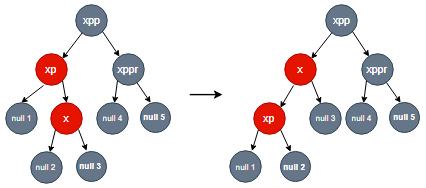

## 红黑树特点

红黑树是每个结点都带有颜色属性的二叉查找树，颜色为红色或黑色。除二叉查找树强制的一般要求以外，对于任何有效的红黑树增加了如下的额外要求：


1. 结点是红色或黑色。
2. 根是黑色。
3. 所有叶子都是黑色。
4. 每个红色结点必须有两个黑色的子结点，从而要求从每个叶子到根的所有路径上不能有两个连续的红色结点。
5. 从任一结点到其每个叶子的所有简单路径都包含相同数目的黑色结点。

这些约束确保了红黑树的关键特性：**从根到叶子的最长的可能路径不多于最短的可能路径的两倍长**。结果是这个树大致上是平衡的。因为操作比如插入、删除和查找某个值的最坏情况时间都要求与树的高度成比例，这个在高度上的理论上限允许红黑树在最坏情况下都是高效的，而不同于普通的二叉查找树，因为试想一下，对于普通的二叉树，如果新插入的结点都在插在了同一侧，那么查找的时间复杂度将等同于在单链表查找某结点的时间复杂度。另外，不同于平衡二叉搜索树，红黑树由于对每个结点加入了颜色属性，使得失衡调整的频率降低了，从而能获得更高的性能。

要知道为什么这些性质能确保了这个关键特性，注意到性质4导致了路径不能有两个毗连的红色节点就足够了。最短的可能路径都是黑色结点，最长的可能路径有交替的红色和黑色结点。因为根据性质5，所有最长的路径都有相同数目的黑色结点，这就表明了没有路径能多于任何其他路径的两倍长。


## 构造

为了更好地理解红黑二叉搜索树这种数据结构，我查询了一些资料，看完之后觉得觉得结合维基百科的介绍、JDK1.8 后的 HashMap 中的红黑树实现代码以及《Algorithm》中的代码一起认识起来会比较简单和直观。	

### 树的旋转

树的旋转操作时通用的，与平衡二叉搜索树类似，当新插入结点导致失衡时，若将最小失衡子树调整为平衡的子树且高度与插入前的高度相同，则整棵树可恢复平衡且无需调整其他结点，对最小失衡子树的调整操作可以归纳为下面四种类型，分别为RR型、LL型、LR型、RL型，这几种情况都涉及了树的旋转操作，而树的旋转操作又分为左旋和右旋，它们互为逆变换。


下面给出红黑二叉搜索树的旋转代码，通过跟踪这两个方法的执行过程不难发现：与平衡二叉树的旋转不同，由于加入了颜色属性，以插入操作为例，只有在新插入的结点的父结点是红色的时候才可能发生失衡，从而进行调整，而不像平衡二叉树只凭`平衡因子`进行判断。

```java
private TreeNode rotateLeft(TreeNode root, TreeNode p) {
    TreeNode r, pp, rl;
    // p 的右子树不为空
    if (p != null && (r = p.right) != null) {
        // 左旋
        if ((rl = p.right = r.left) != null)
            rl.parent = p;
        // 根结点为空，旋转后的右孩子成为新的根
        if ((pp = r.parent = p.parent) == null)
            (root = r).isRed = false;
        // LR情况，此时仍为平衡，需要后续的右旋，此处只做指针域的修改
        else if (pp.left == p)
            pp.left = r;
        // RR情况，此时已平衡
        else
            pp.right = r;
        r.left = p;
        p.parent = r;
    }
    return root;
}

private TreeNode rotateRight(TreeNode root, TreeNode p) {
    TreeNode l, pp, lr;
    if (p != null && (l = p.left) != null) {
        if ((lr = p.left = l.right) != null)
            lr.parent = p;
        if ((pp = l.parent = p.parent) == null)
            (root = l).isRed = false;
        else if (pp.right == p)
            pp.right = l;
        else
            pp.left = l;
        l.right = p;
        p.parent = l;
    }
    return root;
}
```


### 插入平衡

迭代遍历整棵树，用 xp 记录 x 的父结点，xpp 记录 x 的祖父结点，xppl 记录 xpp 的左孩子，xppr 记录 xpp 的右孩子。下面是两种容易理解的情形：

1. 如果 x 为根结点，直接将其颜色改为黑色并返回即可。
2. 如果 x 非根结点，同时其父结点为黑色，由于所有新插入的结点都为红色，不违背红黑树性质，同样地直接返回根结点即可

当 x 的父结点为红色时，假设父结点 xp 是祖父结点 xpp 的左结点（若为右结点也同理）

- 如果父结点 xp 和叔父结点 xppr 二者都是红色，则需将它们都重绘为黑色，另外为了保持性质5，需重绘祖父结点 xpp 为红色。完成后 xpp 变成了黑色的，因为通过 xpp 或叔父结点 xppr 的任何路径都必定通过祖父节点 xpp，在这些路径上的黑节点数目没有改变。但是，红色的祖父结点 xpp 可能是根结点，这就违反了性质2，也有可能祖父结点 xpp 的父结点是红色的，这就违反了性质4。因此需在祖父结点 xpp 上递归地进行`第4行`开始的整个过程，把 xpp 当成是新加入的结点进行各种情形的检查，即 `x = xpp` 后重新进入`第3行`开始的循环。

  

- LR型：父结点 xp 是红色而叔父结点 xppr 是黑色或缺少，并且新结点 x 是其父结点 xp 的右子结点而父结点 xp 又是其父结点的左子结点。在这种情形下，需进行一次左旋调换新节点和其父节点的角色。接着，我们按`LL型`处理以前的父结点 xp 以解决仍然失效的性质4。注意这个改变会导致某些路径通过它们以前不通过的新结点 x（比如图中1号叶子节点）或不通过节点 xp（比如图中3号叶子节点），但由于这两个结点都是红色的，所以性质5仍有效。

  

- LL型：父结点 xp 是红色而叔父结点 xppr 是黑色或缺失，新结点 x 是其父结点的左子结点，而父结点 xp 又是其父结点 xpp 的左子结点。在这种情形下，针对祖父结点 xpp 进行一次右旋；在旋转产生的树中，以前的父结点 xp 成为新结点 x 和以前的祖父结点 xpp 的父结点。以前的祖父结点 xpp 是黑色，否则父结点 p 就不可能是红色，因为如果 xp 和 xpp 都是红色就违反了性质4，所以 xpp 必须是黑色的。此时切换以前的父结点 xp 和祖父结点 xpp 的颜色，使得到的树满足性质4。性质5也仍然保持满足，因为通过这三个结点中任何一个的所有路径以前都通过祖父结点 xpp，现在它们都通过以前的父结点 xp。在各自的情形下，这都是三个结点中唯一的黑色结点。

  

```java
private TreeNode balanceInsertion(TreeNode root, TreeNode x) {
    x.isRed = true;
    for (TreeNode xp, xpp, xppl, xppr;;) {
        if ((xp = x.parent) == null) {
            x.isRed = false;
            x.size = sizeOf(x.left) + sizeOf(x.right) + 1;
            return x;
        }
        // 1.如果x的父结点为黑色，而当前插入结点都为红色的，不违背红黑树性质，直接返回根结点
        // 2.x的祖父结点为空，说明x的父结点是根结点，而根结点又都是黑色的，所以同上返回
        // 个人觉得后面的一个判断是多余的，因为它已经被包含在前面的那个条件中
        // 作者这样写反而让我困惑，如果!xp==red不满足，那岂不是说返回的树中包含了两个连续的红色的结点？
        // 但回到红黑树的定义中，其实根结点就是黑色的，后面的判断根本用不着
        else if (!xp.isRed || (xpp = xp.parent) == null)
            return root;
        // 没有return，能进下面的判断说明x的父结点xp也是红色的
        // 父结点是祖父结点的左结点，则叔父结点是祖父结点的右孩子
        if (xp == (xppl = xpp.left)) {
            // x的叔父结点不为空，同时为红色
            // 把x的父结点和x的叔父结点都重绘成黑色，把祖父结点重绘成红色
            if ((xppr = xpp.right) != null && xppr.isRed) {
                xppr.isRed = false;
                xp.isRed = false;
                xpp.isRed = true;
                // 此时对于祖父结点存在三种情况
                // 1. 如果祖父结点是很结点，将之重绘成黑色
                // 2. 如果祖父结点是很结点非根结点，且父结点为黑色，不用调整
                // 3. 如果祖父结点是很结点非根结点，且父结点为红色
                // 显然这就是上面x已经经过的判断流程，所以直接将祖父结点赋值给x
                // 让它进入下一趟迭代即可
                x = xpp;
            }
            else {  // 右旋是必要的
                // LR型，先左旋再右旋
                if (x == xp.right) {
                    // x在父结点的右边，即符合平衡二叉树的LR失衡状态，需要先左旋后右旋
                    // 以x的父结点为轴进行左旋
                    // 为什么是x=xp然后才调用rotateLeft？
                    // 因为这种是LR型，进行左旋后变成LL型，仍需进行右旋操作
                    // 此时将最左边的那个结点（即原来的xp）视为新插入的加点进行操作
                    root = rotateLeft(root, x = xp);
                    xpp = (xp = x.parent) == null ? null : xp.parent;
                }
                // LL型，需右旋
                if (xp != null) {
                    // 先将最左结点的父结点置为黑色
                    xp.isRed = false;
                    if (xpp != null) {
                        // 祖父结点不为空，将之置为黑色，并以之为轴进行右旋
                        xpp.isRed = true;
                        root = rotateRight(root, xpp);
                    }
                }
            }
        }
        // 父结点是祖父结点的右结点，则叔父结点是祖父结点的左孩子
        else {  // 左旋是必要的
            // x的叔父结点不为空，同时为红色
            // 把x的父结点和x的叔父结点都重绘成黑色，把祖父结点重绘成红色
            if (xppl != null && xppl.isRed) {
                xppl.isRed = false;
                xp.isRed = false;
                xpp.isRed = true;
                // 此时对于祖父结点存在三种情况
                // 1. 如果祖父结点是很结点，将之重绘成黑色
                // 2. 如果祖父结点是很结点非根结点，且父结点为黑色，不用调整
                // 3. 如果祖父结点是很结点非根结点，且父结点为红色
                // 显然这就是上面x已经经过的判断流程，所以直接将祖父结点赋值给x
                // 让它进入下一趟迭代即可
                x = xpp;
            }
            else {
                // RL型，先右旋再左旋
                if (x == xp.left) {
                    root = rotateRight(root, x = xp);
                    xpp = (xp = x.parent) == null ? null : xp.parent;
                }
                // RR型，直接左旋
                if (xp != null) {
                    xp.isRed = false;
                    if (xpp != null) {
                        xpp.isRed = true;
                        root = rotateLeft(root, xpp);
                    }
                }
            }
        }
    }
}
```

### 删除平衡

- 记待删除结点 x，判断 x 是否有两个非叶子的子结点

  - 是则寻找替代，要么找到 x 的左子树中的最大元素、要么找到 x 的右子树中的最小元素，记为 s，把 s 的值转移到 x 中，删除 s，而 s 必定有少于两个非叶子的儿子。因为只是复制了一个值而没有复制颜色，不违反任何性质，这就把问题简化为如何删除最多有一个非叶子儿子的结点的问题。它不关心这个结点是最初要删除的结点还是我们从中复制出值的那个结点。
  - 否则如果 x 只有一个非叶子儿子结点，进一步判断：
     - 如果 x 是红色的，那么 x 的父亲和儿子一定是黑色的。所以我们可以简单的用它的黑色儿子替换它，并不会破坏性质3和性质4。通过被删除节点的所有路径只是少了一个红色结点，这样可以继续保证性质5。
     - 如果 x 是黑色而它的儿子是红色的。如果只是去除 x，用它的红色儿子作为顶替，则会破坏性质5，所以可以重绘 x 的儿子为黑色，则曾经通过它的所有路径将通过它的黑色儿子，这样可以继续保持性质5。
     - 如果 x 和它的儿子两者都是黑色的，这种情况说明 x 的两个儿子都是叶子结点，否则若其中一个儿子是黑色非叶子结点，另一个儿子是叶子结点，那么从 x 通过非叶子结点儿子的路径上的黑色结点数最小为2，而从 x 到另一个叶子结点儿子的路径上的黑色结点数为1，显然违反了性质5。在这种情况下，首先把 x 替换为它的儿子。出于方便，称呼这个儿子为 N（在新的位置上），称呼它的兄弟（它父亲的另一个儿子）为 S。使用**P**称呼N的父亲，**SL**称呼S的左儿子，**SR**称呼S的右儿子。


最后一种情况比较复杂，具体又分为以下情况讨论，假定N是它父亲的左儿子。如果它是右儿子，则在这些情形下的左和右应当对调。

1. 第 7~14 行：如果 S 是红色。则先在 N 的父亲上进行左旋，把红色兄弟转换成 N 的祖父，我们接着对调 N 的父亲和祖父的颜色。完成这两个操作后，尽管所有路径上黑色节点的数目没有改变，但现在 N 有了一个黑色的兄弟和一个红色的父亲（它的新兄弟是黑色因为它是红色S的一个儿子），所以接下去按**情形4**、**情形5**或**情形6**来处理。

   

2. 第 15~18 行：如果 N 的父亲、S 和 S 的儿子都是黑色的。在这种情形下，重绘 S 为红色。结果是通过 S 的所有路径，它们就是以前不通过 N 的那些路径，都少了一个黑色结点。因为删除 N 的初始的父亲使通过 N 的所有路径少了一个黑色结点，这使事情都平衡了起来。但是，通过 P 的所有路径现在比不通过P的路径少了一个黑色节点，所以仍然违反性质5。要修正这个问题，我们要从**情形1**开始，在P上做重新平衡处理。

   

3. 第 19~22 行：S 和 S 的儿子都是黑色，但是 N 的父亲是红色。在这种情形下，交换 N 的兄弟和父亲的颜色。这不影响不通过 N 的路径的黑色结点的数目，但是它在通过 N 的路径上对黑色结点数目增加了一，添补了在这些路径上删除的黑色结点。

   

4. 第 24~35 行：如果 S 是黑色，S 的左儿子是红色，S 的右儿子是黑色，而 N 是它父亲的左儿子，则先在 S 上进行右旋，这样 S 的左儿子成为S的父亲和N的新兄弟。接着交换 S 和它的新父亲的颜色。所有路径仍有同样数目的黑色结点，但是现在 N 有了一个黑色兄弟，其右儿子是红色的，进入下一步。

   

5. 第 36~45 行：如果 S 是黑色，S 的右儿子是红色，而 N 是它父亲的左儿子。则先在 N 的父亲上进行左旋，这样 S 成为 N 的父亲（P）和 S 的右儿子的父亲。接着交换 N 的父亲和 S 的颜色，并使 S 的右儿子为黑色。子树在它的根上的仍是同样的颜色，所以性质3没有被违反。但是，N 现在增加了一个黑色祖先：要么 N 的父亲变成黑色，要么它是黑色而S被增加为一个黑色祖父。所以，通过N的路径都增加了一个黑色节点。

   

```java
private void delete(TreeNode p) {
    if(p.parent == null){
        p.isRed = false;
        return;
    }
    TreeNode s = sibling(p);
    if (s.isRed) {
        p.parent.isRed = true;
        s.isRed = false;
        if (p == p.parent.left)
            rotateLeft(root, p.parent);
        else
            rotateRight(root, p.parent);
    }
    if (!p.parent.isRed && !s.isRed && !s.left.isRed && !s.right.isRed) {
        s.isRed = true;
        delete(p.parent);
    } 
    else if (p.parent.isRed && !s.isRed && !s.left.isRed && !s.right.isRed) {
        s.isRed = true;
        p.parent.isRed = false;
    } 
    else {
        if (!s.isRed) {
            if (p == p.parent.left && s.left.isRed && !s.right.isRed) {
                s.isRed = true;
                s.left.isRed = false;
                rotateRight(root, s);
            } 
            else if (p == p.parent.right && !s.left.isRed && s.right.isRed) {
                s.isRed = true;
                s.right.isRed = false;
                rotateLeft(root, s);
            }
        }
        s.isRed = p.parent.isRed;
        p.parent.isRed = false;
        if (p == p.parent.left){
            s.right.isRed = false;
            rotateLeft(root, p.parent);
        } 
        else {
            s.left.isRed = false;
            rotateRight(root, p.parent);
        }
    }
}
```
