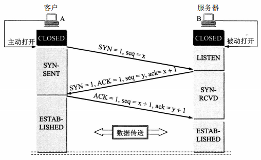
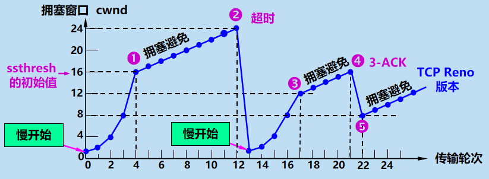

## 三次握手

通常由一端打开一个套接字（socket）然后监听来自另一方的连接，这就是通常所指的`被动打开（passive open）`。服务器端被被动打开以后，用户端就能开始创建`主动打开（active open）`。

1. 服务器创建`TCB表项`，进入`LISTEN`状态，准备接受客户端进程的连接请求。
2. 客户端进程先创建`TCB表项`，记录连接信息和缓存指针，然后向服务器发送请求报文**MR**，**MR**头中的同步位`SYN（Synchronize Sequence Numbers）= 1`，同时随机选择一个初始序号 `seq = x`（一般地，seq=0）。**MR**不允许携带数据，这时客户端进入`SYN-SENT`状态。
3. 服务器检查**MR**中的`SYN`的合法性，如果同意建立连接，则向客户端发送确认报文**AS**，**AS**头中的`SYN = 1, ACK = 1, 确认号ack = x+1`，同时自己随机选择一个初始序号`seq = y`，**AS**不允许携带数据，这时服务器进入`SYN-RCVD`状态。
4. 客户端对服务器的确认报文**AS**进行确认，无误后向服务器发送对**AS**的确认报文**AC**，表示自己已经收到**As**，其中**AC**头中`ACK = 1，ack = y+1, seq = x+1`，**AC**允许携带数据，但如果不携带数据，客户端的下一个数据报的序号仍为`swq=x+1`，这时客户端进入`ESTABLISHED`状态。
5. 服务器收到**Mc**后也进入`ESTABLISHED`状态。

发送**AC**是**为了防止客户端的已失效的连接请求报文在此时延迟地发送到服务器**，在没有第四步的情况下，考虑下面异常场景：

1. 客户端发送一次请求报文**MR1**，在过了一段时间后，并没收到服务器对其的确认报文**AS1**，于是重传请求报文**MR2**。
2. 服务器响应对**MR2**的确认报文**AS2**，连接建立。
3. 正常传输数据，连接释放。
4. 由于网络延迟，**MR1**到达服务器，服务器以为是一个新的请求，于是向客户端响应确认报文**AS1**，这时服务器"一厢情愿"地进入`ESTABLISHED`状态。
5. 这时客户端并没有发出建立连接的请求，因此不会理睬**AS1**，也不会向服务器发送数据。但服务器却以为新的传输连接己经建立，并一直等待客户端发来数据。因此它的许多资源就这样白白浪费了。

## 四次挥手

TCP连接释放经历了所谓的`四次挥手`过程。

1. 数据传输结束后，通信的双方都可释放连接。现在服务器和客户端都处于`ESTABLISHED`状态。
2. 客户端应用进程先向其TCP发出`连接释放报文段`，并停止再发送数据，`主动关闭`TCP连接。客户端把连接释放报文段首部的终止控制位`FIN=1` , 其序号`seq = u`, 它等于前面己传送过的数据的最后一个字节的序号加1。这时客户端进入`FIN-WAIT-1`状态，等待服务器确认。FIN报文段即使不携带数据。
3. 服务器收到`连接释放报文段`后即发出确认报文，`确认号字段`是`ack = u+l`，序号是`seq=v` ,等于服务器前面己传送过的数据的最后一个字节的序号加1。然后服务器就进入`CLOSE-WAIT (关闭等待）`状态。TCP服务器进程这时应通知高层应用进程，因而从`客户端到服务器方向`的连接已经释放，这时的TCP连接处于`半关闭（half-dose）`状态，即客户端己经没有数据要发送了，但服务器若发送数据，客户端仍要接收，即从`服务器到客户端`方向的连接并未关闭，这个状态可能会持续一段时间。客户端收到来自服务器的确认后，就进入`FIN-WAIT-2（终止等待2）`状态，等待服务器发出的连接释放报文段。
4. 若服务器已无要向客户端发送的数据，其应用进程就通知TCP释放连接。这时服务器发出的连接释放报文段必须使`FIN=1`，现假定B的序号为`seq=w`（在半关闭状态B可能又发送了一些数据）。因为该期间客户端没有发送数据报，服务器还必须重复上次己发送过的确认号`ack=u+1`。这时服务器进入`LAST-ACK (最后确认)`状态，等待客户端的确认。
5. 客户端在收到服务器的连接释放报文段后，必须对此发出确认。在确认报文段中把`ACK=1, ack=w+1,seq=u+1`，然后进入到`TIME-WAIT（时间等待）`状态，经过`2MSL`长时间（四分钟，或根据实际情况调整）等待后进入`CLOSED`状态，整个TCP连接释放。

客户端在`TIME-WAIT`状态等待`2MSL`长时间的原因有：

- 为了保证客户端发送的最后一个`ACK报文段`能够到达服务器。因为该`ACK报文段`有可能丢失，从而使处在`LAST-ACK`状态的服务器收不到客户端对己发送的`FIN + ACK报文段`的确认。服务器会超时重传该`FIN + ACK报文段`，而客户端就能在`2MSL`时间内收到这个重传的`FIN + ACK报文段`。接着客户端重传一次确认，重启`2MSL`计时器。最后两者都正常进入`CLOSED`状态。如果客户端在`TIME-WAIT`状态不等待一段时间，而是在发送完`ACK报文段`后立即释放连接，那么就无法在`确认丢失`的情况下收到服务器重传的`FIN + ACK报文段`，因而也不会再发送一次确认报文段。这样，服务器就无法按照正常步骤进入`CLOSED`状态，服务器就很尴尬了。
- 防止出现类似`三次握手`中提到的`己失效的连接请求报文段出现在本连接中`。客户端在发送完最后一个`ACK报文段`后，再经过时间`2MSL`，才能结束本次连接，开始建立新的连接，这样就可以使本连接持续的时间内所产生的所有报文段都从网络中消失，使下一个新的连接中不会出现这种旧的连接请求报文段。服务器只要收到客户端发出的确认，就进入`CLOSED`状态，在撤销相应的`TCB`后，结束本次TCP连接。（否则新的客户端连接还是可能收到上一次连接的服务端的延时数据报）

## TCP 如何保证可靠传输

**TCP通过序列号、检验和、确认应答信号、重发控制、连接管理、窗口控制、流量控制、拥塞控制实现可靠性。**

1. 针对数据包到达接收端主机顺序乱掉的顺序控制
2. 针对发送端发出的数据包的确认应答信号ACK
3. 针对数据包丢失或者出现定时器超时的重发机制
4. 针对高效传输数据包的滑动窗口控制
5. 针对避免网络拥堵时候的流量控制
6. 针对刚开始启动的时候避免一下子发送大量数据包而导致网络瘫痪的慢启动算法和拥塞控制。

具体：

1. TCP 给发送的每一个包进行编号，接收方对数据包进行排序，把有序数据传送给应用层。
2. 设置校验和，用于检测数据在传输过程中的任何变化。如果收到段的检验和有差错，TCP 将丢弃这个报文段和不确认收到此报文段。
3. **停止等待与超时重传**：
   - 停止等待：每发完一个分组就停止发送，等待对方确认。在收到确认后再发下一个分组。 
   - 超时重传：当 TCP 发出一个段后，它启动一个定时器，等待目的端确认收到这个报文段。如果不能及时收到一个确认，将重发这个报文段。
4. **流量控制**： TCP 连接的每一方都有固定大小的缓冲空间，TCP的接收端只允许发送端发送接收端缓冲区能接纳的数据。当接收方来不及处理发送方的数据，能提示发送方降低发送的速率，防止包丢失。TCP 使用的流量控制协议是可变大小的滑动窗口协议。 （TCP 利用滑动窗口实现流量控制）
5. **拥塞控制**： 当网络拥塞时，减少数据的发送。
   - 慢开始：用于试探网络拥塞情况，在该阶段，发送方的拥塞窗口大小呈指数增长，当大于`慢开始门限值`时开始使用拥塞避免算法。
   - 拥塞避免：拥塞窗口大小呈线性规律增长
   - 快重传：发送方只要一连收到三个重复确认，就知道接收方没有收到该确认对应报文的下一个报文，因而进行立即重传。
   - 快恢复：经过快重传后，发送方世道现在丢失了几个报文，网络不是很稳定但也不至于很拥塞，于是启用快恢复算法，降低门限值后使用拥塞避免而不是慢开始算法。

## 拥塞控制

- 慢开始：用于试探网络拥塞情况，在该阶段，发送方的拥塞窗口大小呈指数增长，当大于`慢开始门限值`时开始使用拥塞避免算法。
- 拥塞避免：拥塞窗口大小呈线性规律增长
- 快重传：发送方只要一连收到三个重复确认，就知道接收方没有收到该确认对应报文的下一个报文，因而进行立即重传。
- 快恢复：经过快重传后，发送方世道现在丢失了几个报文，网络不是很稳定但也不至于很拥塞，于是启用快恢复算法，降低门限值后使用拥塞避免而不是慢开始算法。

1. 慢开始末段，拥塞窗口大小到门限值，改为拥塞避免
2. 出现超时，门限值 = 拥塞窗口大小 / 2，拥塞窗口大小 = 1，重新进入慢开始状态
3. 拥塞窗口大小达到新的门限值，重新进入拥塞避免阶段
4. 出现三个重复确认，进行快重传
5. 快重传解决了少量包丢失问题，进入快恢复阶段，门限值 = 拥塞窗口大小 / 2，拥塞窗口大小减半，进行拥塞避免

##  粘包现象

因为 TCP 是基于字节流的，虽然应用层和TCP传输层之间的数据交互是大小不等的数据块，但是 TCP 把这些数据块仅仅看成一连串无结构的字节流，没有边界；另外TCP 的报文首部中没有表示数据长度的字段，因为这样，在使用 TCP 传输数据时，可能会发生粘包或者拆包的现象。

1. 接收端正常收到两个数据包，即没有发生拆包和粘包的现象。
2. 接收端只收到一个数据包，由于 TCP 是不会出现丢包的，所以这一个数据包中包含了发送端发送的两个数据包的信息，这种现象即为粘包。这种情况由于接收端不知道这两个数据包的界限，所以对于接收端来说很难处理。
3. 接收端收到了l两个数据包，但是这两个数据包要么是不完整的，要么就是多出来一块，这种情况即发生了拆包和粘包。这两种情况如果不加特殊处理，对于接收端同样是不好处理的。
4. 接收端收到了三个数据包，同样发生了拆包和粘包。

发生 TCP 粘包或拆包有很多原因：

1. 要发送的数据大于 TCP 发送缓冲区剩余空间大小，将会发生拆包。
2. 待发送数据大于 MSS（最大报文长度），TCP 在传输前将进行拆包。
3. 要发送的数据小于 TCP 发送缓冲区的大小，TCP 将多次写入缓冲区的数据一次发送出去，将会发生粘包。
4. 接收数据端的应用层没有及时读取接收缓冲区中的数据，将发生粘包。

粘包、拆包解决办法：

1. 发送端给每个数据包添加包首部，首部中应该至少包含数据包的长度，这样接收端在接收到数据后，通过读取包首部的长度字段，便知道每一个数据包的实际长度了。

2. 发送端将每个数据包封装为固定长度（不够的可以通过补0填充），这样接收端每次从接收缓冲区中读取固定长度的数据就自然而然的把每个数据包拆分开来。

3. 可以在数据包之间设置边界，如添加特殊符号，这样，接收端通过这个边界就可以将不同的数据包拆分开。

其他协议存在粘包现象吗？

 对于UDP，其报文首部设置了两个字节大小的长度位用来标记整个数据报的长度，因此在应用层能很好的将不同的数据报文区分开，从而避免粘包和拆包的问题。同样，HTTP的首部集合中也包含了Content-Length 用于记录实体的大小。而对于 TCP，作为一个面向字节的传输层协议，它不关心传输的内容结构，而只专注于可靠的传输，所以"TCP粘包问题"是个假问题。