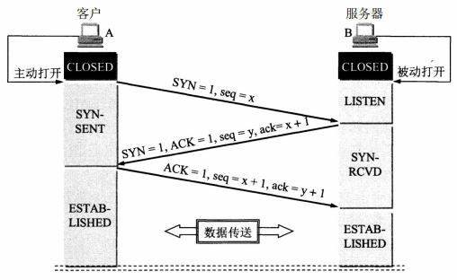
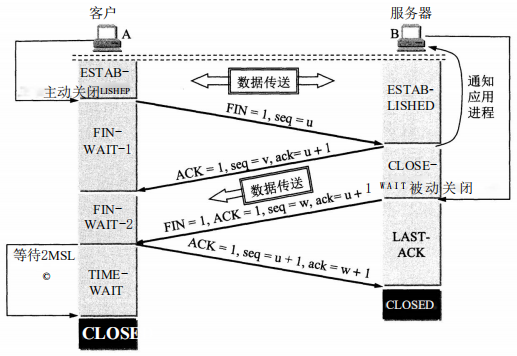
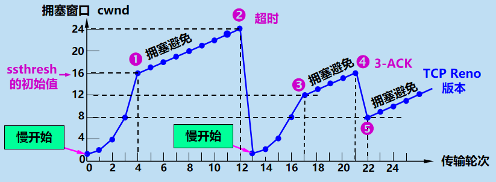
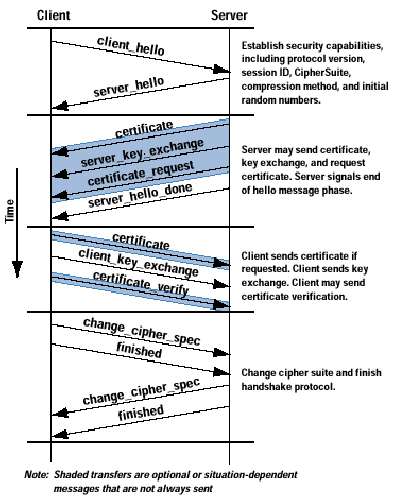

## 运输层

### TCP

#### 三次握手

通常由一端打开一个套接字（socket）然后监听来自另一方的连接，这就是通常所指的`被动打开（passive open）`。服务器端被被动打开以后，用户端就能开始创建`主动打开（active open）`。

1. 服务器创建`TCB表项`，进入`LISTEN`状态，准备接受客户端进程的连接请求。
2. 客户端进程先创建`TCB表项`，记录连接信息和缓存指针，然后向服务器发送请求报文**MR**，**MR**头中的同步位`SYN（Synchronize Sequence Numbers）= 1`，同时随机选择一个初始序号 `seq = x`（一般地，seq=0）。**MR**不允许携带数据，这时客户端进入`SYN-SENT`状态。
3. 服务器检查**MR**中的`SYN`的合法性，如果同意建立连接，则向客户端发送确认报文**AS**，**AS**头中的`SYN = 1, ACK = 1, 确认号ack = x+1`，同时自己随机选择一个初始序号`seq = y`，**AS**不允许携带数据，这时服务器进入`SYN-RCVD`状态。
4. 客户端对服务器的确认报文**AS**进行确认，无误后向服务器发送对**AS**的确认报文**AC**，表示自己已经收到**As**，其中**AC**头中`ACK = 1，ack = y+1, seq = x+1`，**AC**允许携带数据，但如果不携带数据，客户端的下一个数据报的序号仍为`swq=x+1`，这时客户端进入`ESTABLISHED`状态。
5. 服务器收到**Mc**后也进入`ESTABLISHED`状态。

发送**AC**是**为了防止客户端的已失效的连接请求报文在此时延迟地发送到服务器**，在没有第四步的情况下，考虑下面异常场景：

1. 客户端发送一次请求报文**MR1**，在过了一段时间后，并没收到服务器对其的确认报文**AS1**，于是重传请求报文**MR2**。
2. 服务器响应对**MR2**的确认报文**AS2**，连接建立。
3. 正常传输数据，连接释放。
4. 由于网络延迟，**MR1**到达服务器，服务器以为是一个新的请求，于是向客户端响应确认报文**AS1**，这时服务器"一厢情愿"地进入`ESTABLISHED`状态。
5. 这时客户端并没有发出建立连接的请求，因此不会理睬**AS1**，也不会向服务器发送数据。但服务器却以为新的传输连接己经建立，并一直等待客户端发来数据。因此它的许多资源就这样白白浪费了。

#### 四次挥手

TCP连接释放经历了所谓的`四次挥手`过程。

1. 数据传输结束后，通信的双方都可释放连接。现在服务器和客户端都处于`ESTABLISHED`状态。
2. 客户端应用进程先向其TCP发出`连接释放报文段`，并停止再发送数据，`主动关闭`TCP连接。客户端把连接释放报文段首部的终止控制位`FIN=1` , 其序号`seq = u`, 它等于前面己传送过的数据的最后一个字节的序号加1。这时客户端进入`FIN-WAIT-1`状态，等待服务器确认。FIN报文段即使不携带数据。
3. 服务器收到`连接释放报文段`后即发出确认报文，`确认号字段`是`ack = u+l`，序号是`seq=v` ,等于服务器前面己传送过的数据的最后一个字节的序号加1。然后服务器就进入`CLOSE-WAIT (关闭等待）`状态。TCP服务器进程这时应通知高层应用进程，因而从`客户端到服务器方向`的连接已经释放，这时的TCP连接处于`半关闭（half-dose）`状态，即客户端己经没有数据要发送了，但服务器若发送数据，客户端仍要接收，即从`服务器到客户端`方向的连接并未关闭，这个状态可能会持续一段时间。客户端收到来自服务器的确认后，就进入`FIN-WAIT-2（终止等待2）`状态，等待服务器发出的连接释放报文段。
4. 若服务器已无要向客户端发送的数据，其应用进程就通知TCP释放连接。这时服务器发出的连接释放报文段必须使`FIN=1`，现假定B的序号为`seq=w`（在半关闭状态B可能又发送了一些数据）。因为该期间客户端没有发送数据报，服务器还必须重复上次己发送过的确认号`ack=u+1`。这时服务器进入`LAST-ACK (最后确认)`状态，等待客户端的确认。
5. 客户端在收到服务器的连接释放报文段后，必须对此发出确认。在确认报文段中把`ACK=1, ack=w+1,seq=u+1`，然后进入到`TIME-WAIT（时间等待）`状态，经过`2MSL`长时间（四分钟，或根据实际情况调整）等待后进入`CLOSED`状态，整个TCP连接释放。

客户端在`TIME-WAIT`状态等待`2MSL`长时间的原因有：

- 为了保证客户端发送的最后一个`ACK报文段`能够到达服务器。因为该`ACK报文段`有可能丢失，从而使处在`LAST-ACK`状态的服务器收不到客户端对己发送的`FIN + ACK报文段`的确认。服务器会超时重传该`FIN + ACK报文段`，而客户端就能在`2MSL`时间内收到这个重传的`FIN + ACK报文段`。接着客户端重传一次确认，重启`2MSL`计时器。最后两者都正常进入`CLOSED`状态。如果客户端在`TIME-WAIT`状态不等待一段时间，而是在发送完`ACK报文段`后立即释放连接，那么就无法在`确认丢失`的情况下收到服务器重传的`FIN + ACK报文段`，因而也不会再发送一次确认报文段。这样，服务器就无法按照正常步骤进入`CLOSED`状态，服务器就很尴尬了。
- 防止出现类似`三次握手`中提到的`己失效的连接请求报文段出现在本连接中`。客户端在发送完最后一个`ACK报文段`后，再经过时间`2MSL`，才能结束本次连接，开始建立新的连接，这样就可以使本连接持续的时间内所产生的所有报文段都从网络中消失，使下一个新的连接中不会出现这种旧的连接请求报文段。服务器只要收到客户端发出的确认，就进入`CLOSED`状态，在撤销相应的`TCB`后，结束本次TCP连接。（否则新的客户端连接还是可能收到上一次连接的服务端的延时数据报）

#### TCP 如何保证可靠传输

**TCP通过序列号、检验和、确认应答信号、重发控制、连接管理、窗口控制、流量控制、拥塞控制实现可靠性。**

1. 针对数据包到达接收端主机顺序乱掉的顺序控制
2. 针对发送端发出的数据包的确认应答信号ACK
3. 针对数据包丢失或者出现定时器超时的重发机制
4. 针对高效传输数据包的滑动窗口控制
5. 针对避免网络拥堵时候的流量控制
6. 针对刚开始启动的时候避免一下子发送大量数据包而导致网络瘫痪的慢启动算法和拥塞控制。

具体：

1. TCP 给发送的每一个包进行编号，接收方对数据包进行排序，把有序数据传送给应用层。
2. 设置校验和，用于检测数据在传输过程中的任何变化。如果收到段的检验和有差错，TCP 将丢弃这个报文段和不确认收到此报文段。
3. **停止等待与超时重传**：
   - 停止等待：每发完一个分组就停止发送，等待对方确认。在收到确认后再发下一个分组。 
   - 超时重传：当 TCP 发出一个段后，它启动一个定时器，等待目的端确认收到这个报文段。如果不能及时收到一个确认，将重发这个报文段。
4. **流量控制**： TCP 连接的每一方都有固定大小的缓冲空间，TCP的接收端只允许发送端发送接收端缓冲区能接纳的数据。当接收方来不及处理发送方的数据，能提示发送方降低发送的速率，防止包丢失。TCP 使用的流量控制协议是可变大小的滑动窗口协议。 （TCP 利用滑动窗口实现流量控制）
5.  **拥塞控制**： 当网络拥塞时，减少数据的发送。
   - 慢开始：用于试探网络拥塞情况，在该阶段，发送方的拥塞窗口大小呈指数增长，当大于`慢开始门限值`时开始使用拥塞避免算法。
   - 拥塞避免：拥塞窗口大小呈线性规律增长
   - 快重传：发送方只要一连收到三个重复确认，就知道接收方没有收到该确认对应报文的下一个报文，因而进行立即重传。
   - 快恢复：经过快重传后，发送方世道现在丢失了几个报文，网络不是很稳定但也不至于很拥塞，于是启用快恢复算法，降低门限值后使用拥塞避免而不是慢开始算法。

#### 拥塞控制

- 慢开始：用于试探网络拥塞情况，在该阶段，发送方的拥塞窗口大小呈指数增长，当大于`慢开始门限值`时开始使用拥塞避免算法。

- 拥塞避免：拥塞窗口大小呈线性规律增长
- 快重传：发送方只要一连收到三个重复确认，就知道接收方没有收到该确认对应报文的下一个报文，因而进行立即重传。
- 快恢复：经过快重传后，发送方世道现在丢失了几个报文，网络不是很稳定但也不至于很拥塞，于是启用快恢复算法，降低门限值后使用拥塞避免而不是慢开始算法。

1. 慢开始末段，拥塞窗口大小到门限值，改为拥塞避免
2. 出现超时，门限值 = 拥塞窗口大小 / 2，拥塞窗口大小 = 1，重新进入慢开始状态
3. 拥塞窗口大小达到新的门限值，重新进入拥塞避免阶段
4. 出现三个重复确认，进行快重传
5. 快重传解决了少量包丢失问题，进入快恢复阶段，门限值 = 拥塞窗口大小 / 2，拥塞窗口大小减半，进行拥塞避免

## 应用层

### HTTP

#### session 与 cookie的区别

**cookie：**指某些网站为了辨别用户身份而储存在用户本地终端（Client Side）上的数据（通常经过加密）

因为HTTP协议是无状态的，即服务器不知道用户上一次做了什么，这严重阻碍了交互式Web应用程序的实现。例如当登录一个网站时，网站往往会请求用户输入用户名和密码，并且用户可以勾选“下次自动登录”。如果勾选了，那么下次访问同一网站时，用户会发现没输入用户名和密码就已经登录了。这正是因为前一次登录时，服务器发送了包含登录凭据（用户名加密码的某种加密形式）的Cookie到用户的硬盘上。第二次登录时，如果该Cookie尚未到期，浏览器会发送该Cookie，服务器验证凭据，于是不必输入用户名和密码就让用户登录了。

Cookie 总是保存在客户端中，按在客户端中的存储位置，可分为内存 Cookie 和硬盘 Cookie，内存 Cookie 持续时间短，浏览器关闭后就消失了，硬盘 Cookie 则可以长期保存。

Cookie 的缺点

- Cookie 会被附加在每个 HTTP 请求中，所以无形中增加了流量。
- 由于在HTTP请求中的 Cookie 是明文传递的，所以安全性成问题，除非用HTTPS。
- Cookie的大小限制在4KB左右，对于复杂的存储需求来说是不够用的。
- 存在 Cookie 窃取、Cookie篡改等安全问题

**session**：存储用户信息到服务器的某个文件中，它运行依赖 session id，而 session id 是存在 cookie 中的，所以如果浏览器禁用了 cookie ，那么 session 也会失效，但是可以通过比如在 url 中传递 session_id 的方式

以身份验证为例，在双方建立连接后，服务端创建session，将 session id 存到客户端 cookie 中，客户端服务端时下次访问时，只需要将cookie发送到服务端即可，服务端通过 session 验证用户身份进行后续操作

#### 请求方法      

#### 状态码

##### 服务端与客户端的交互消息

请求已被接受，需要继续处理。这类响应是临时响应，只包含状态行和某些可选的响应头信息，并以空行结束。由于 HTTP/1.0 协议中没有定义任何 1xx 状态码，所以除非在某些试验条件下，服务器禁止向此类客户端发送 1xx 响应。

- 100 Continue：客户端应当继续发送请求。这个临时响应是用来通知客户端它的部分请求已经被服务器接收，且仍未被拒绝。客户端应当继续发送请求的剩余部分，
- 101 Switching Protocols：服务器已理解客户端的请求，将通过Upgrade消息头通知客户端采用不同的协议来完成该请求。在发送完这个响应最后的空行后，服务器将会切换到在Upgrade消息头中定义的那些协议。
- 102 Processing：处理将被继续执行

##### 请求成功

这一类型的状态码，代表请求已成功被服务器接收、理解、并接受。

- 200 OK：请求已成功，请求所希望的响应头或数据体将随此响应返回
- 201 Created：请求已经被实现，而且有一个新的资源已经依据请求的需要而建立，且其 URI 已经随Location 头信息返回。假如需要的资源无法及时建立的话，应当返回 '202 Accepted'。
- 202 Accepted：服务器已接受请求，但尚未处理。
- 203 Non-Authoritative Information：服务器已成功处理了请求，但返回的实体头部元信息不是在原始服务器上有效的确定集合，而是来自本地或者第三方的拷贝。
- 204 No Content：服务器成功处理了请求，但不需要返回任何实体内容，并且希望返回更新了的元信息。
- 205 Reset Content：服务器成功处理了请求，且没有返回任何内容。但是与204响应不同，返回此状态码的响应要求请求者重置文档视图。该响应主要是被用于接受用户输入后，立即重置表单，以便用户能够轻松地开始另一次输入。
- 206 Partial Content：服务器已经成功处理了部分 GET 请求。类似于 FlashGet 或者迅雷这类的 HTTP下载工具都是使用此类响应实现断点续传或者将一个大文档分解为多个下载段同时下载。
- 207 Multi-Status：代表之后的消息体将是一个 XML 消息，并且可能依照之前子请求数量的不同，包含一系列独立的响应代码。

##### 重定向

这类状态码代表需要客户端采取进一步的操作才能完成请求。通常，这些状态码用来重定向，后续的请求地址（重定向目标）在本次响应的 Location 域中指明。

当且仅当后续的请求所使用的方法是 GET 或者 HEAD 时，用户浏览器才可以在没有用户介入的情况下自动提交所需要的后续请求。客户端应当自动监测无限循环重定向（例如：A->A，或者A->B->C->A），因为这会导致服务器和客户端大量不必要的资源消耗。按照 HTTP/1.0 版规范的建议，浏览器不应自动访问超过5次的重定向。

- 300 Multiple Choices
- 301 Moved Permanently
- 302 Move temporarily
- 303 See Other
- 304 Not Modified
- 305 Use Proxy
- 306 Switch Proxy
- 307 Temporary Redirect

##### 客户端请求错误

代表了客户端看起来可能发生了错误，妨碍了服务器的处理。除非响应的是一个 HEAD 请求，否则服务器就应该返回一个解释当前错误状况的实体，以及这是临时的还是永久性的状况。这些状态码适用于任何请求方法。浏览器应当向用户显示任何包含在此类错误响应中的实体内容。
如果错误发生时客户端正在传送数据，那么使用TCP的服务器实现应当仔细确保在关闭客户端与服务器之间的连接之前，客户端已经收到了包含错误信息的数据包。如果客户端在收到错误信息后继续向服务器发送数据，服务器的TCP栈将向客户端发送一个重置数据包，以清除该客户端所有还未识别的输入缓冲，以免这些数据被服务器上的应用程序读取并干扰后者。

- 400 Bad Request
- 401 Unauthorized
- 402 Payment Required
- 403 Forbidden
- 404 Not Found
- 405 Method Not Allowed
- 406 Not Acceptable
- 407 Proxy Authentication Required
- 408 Request Timeout
- 409 Conflict
- 410 Gone
- 411 Length Required
- 412 Precondition Failed
- 413 Request Entity Too Large
- 414 Request-URI Too Long
- 415 Unsupported Media Type
- 416 Requested Range Not Satisfiable
- 417 Expectation Failed
- 418 I'm a teapot
- 421 too many connections
- 422 Unprocessable Entity
- 423 Locked
- 424 Failed Dependency
- 425 Unordered Collection
- 426 Upgrade Required
- 449 Retry With
- 451Unavailable For Legal Reasons

##### 服务器错误

类状态码代表了服务器在处理请求的过程中有错误或者异常状态发生，也有可能是服务器意识到以当前的软硬件资源无法完成对请求的处理。除非这是一个HEAD 请求，否则服务器应当包含一个解释当前错误状态以及这个状况是临时的还是永久的解释信息实体。浏览器应当向用户展示任何在当前响应中被包含的实体。

- 500 Internal Server Error
- 501 Not Implemented
- 502 Bad Gateway
- 503 Service Unavailable
- 504 Gateway Timeout
- 505 HTTP Version Not Supported
- 506 Variant Also Negotiates
- 507 Insufficient Storage
- 509 Bandwidth Limit Exceeded
- 510 Not Extended
- 600 Unparseable Response Headers

### HTTPS

### SSL/TLS

基于TCP/IP，提供一个安全的握手来初始化一个TCP/IP连接，完成客户端和服务器之间关于安全等级、密码算法、通信密钥的协商，以及执行对连接端身份的认证工作。在连接建立之后，SSL连接所传送的应用层协议数据否会被加密，从而摆正通信的机密性。协议结构上包括：握手协议、告警协议、修改密文协议和记录协议，其中最复杂和最重要的是握手协议。

1. 先通过三次握手，建立 TCP 连接
2. 客户端发送 client_hello 请求报文，其中包括客户端支持的SSL版本号、产生的随机数、会话ID、密码算法列表、压缩算法列表等信息。
3. 服务端响应 server_hello 报文，其中包括从饥饿护短列表中选出的SSL版本号、产生随机数、会话ID、客户端列表中选出的密码算法、选定的压缩算法。
4. 服务器发送 CA 中心签发的 X509 证书，包括服务器信息和公钥，客户端可以用该公钥向服务器发送加密信息
5. 服务器发送 certificate_request 请求客户端提供证书进行双向认证，但由于客户端一般是匿名的，所以该消息可选
6. 服务器发送server_hello_done：完成通信，等待客户端应答
7. 如果进行双向认证，客户端响应 certificate_request 报文，发送自己的 X509 证书到服务器
8. 客户端发送 client_key_exchange，即客户端密钥交换消息，用于约定后续通信中的对称加密算法，该消息包含一个使用服务器的 RSA 公钥加密或DH算法运算得到的数值
9. 若用户提供了证书，客户端发送 certifacate_verify 消息，作为客户端签名
10. 客户端发送 change_cipher_spec 消息，表示将使用选定的密码算法和参数进行将来的通信。
11. 客户端发送 finished 消息，完成通信
12. 服务端发送 change_cipher_spec 消息，表示将使用与客户端一样的的密码算法和参数进行将来的通信。
13. 服务端发送 finished 消息，完成通信

## 常见问题

### HTTPS和HTTP的区别

- 端口
- 安全
- 协议结构

