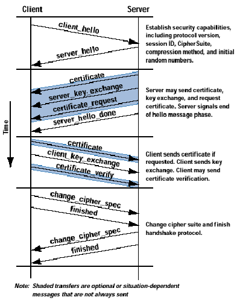

## SSL/TLS

基于TCP/IP，提供一个安全的握手来初始化一个TCP/IP连接，完成客户端和服务器之间关于安全等级、密码算法、通信密钥的协商，以及执行对连接端身份的认证工作。在连接建立之后，SSL连接所传送的应用层协议数据否会被加密，从而摆正通信的机密性。协议结构上包括：握手协议、告警协议、修改密文协议和记录协议，其中最复杂和最重要的是握手协议。

1. 先通过三次握手，建立 TCP 连接
2. 客户端发送 client_hello 请求报文，其中包括客户端支持的SSL版本号、产生的随机数、会话ID、密码算法列表、压缩算法列表等信息。
3. 服务端响应 server_hello 报文，其中包括从饥饿护短列表中选出的SSL版本号、产生随机数、会话ID、客户端列表中选出的密码算法、选定的压缩算法。
4. 服务器发送 CA 中心签发的 X509 证书，包括服务器信息和公钥，客户端可以用该公钥向服务器发送加密信息
5. 服务器发送 certificate_request 请求客户端提供证书进行双向认证，但由于客户端一般是匿名的，所以该消息可选
6. 服务器发送 server_hello_done：完成通信，等待客户端应答
7. 如果进行双向认证，客户端响应 certificate_request 报文，发送自己的 X509 证书到服务器
8. 客户端发送 client_key_exchange，即客户端密钥交换消息，用于约定后续通信中的对称加密算法，该消息包含一个使用服务器的 RSA 公钥加密或DH算法运算得到的数值
9. 若用户提供了证书，客户端发送 certifacate_verify 消息，作为客户端签名
10. 客户端发送 change_cipher_spec 消息，表示将使用选定的密码算法和参数进行将来的通信。
11. 客户端发送 finished 消息，完成通信
12. 服务端发送 change_cipher_spec 消息，表示将使用与客户端一样的的密码算法和参数进行将来的通信。
13. 服务端发送 finished 消息，完成通信

## 常见问题

### HTTPS和HTTP的区别

- 端口
- 安全
- 协议结构